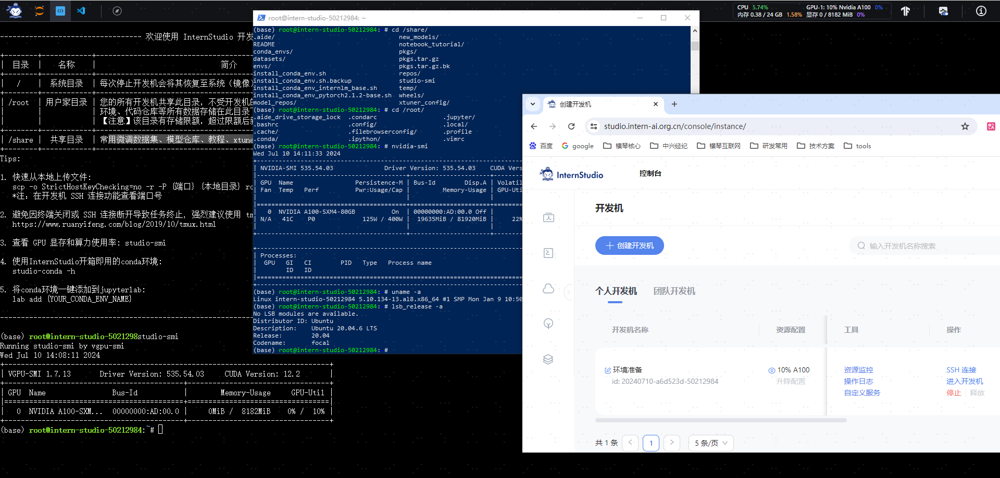
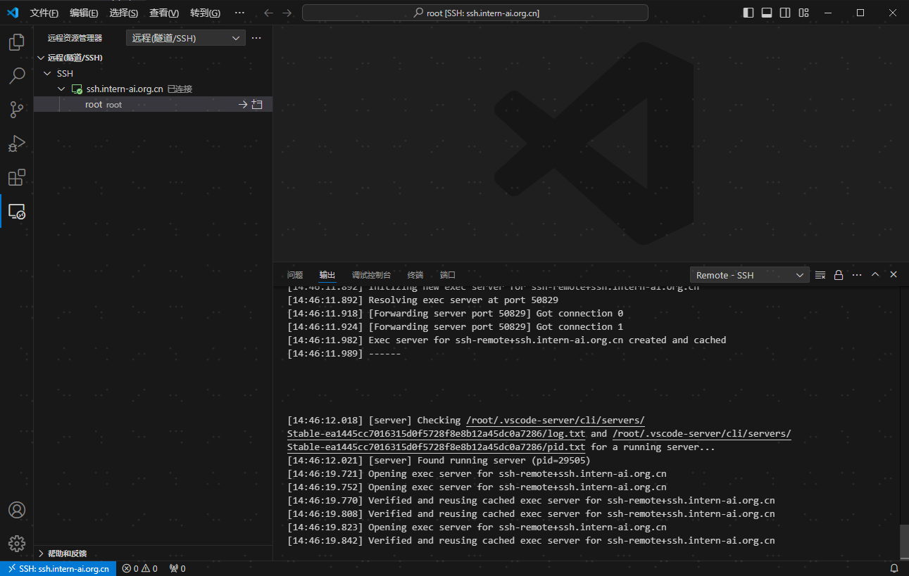
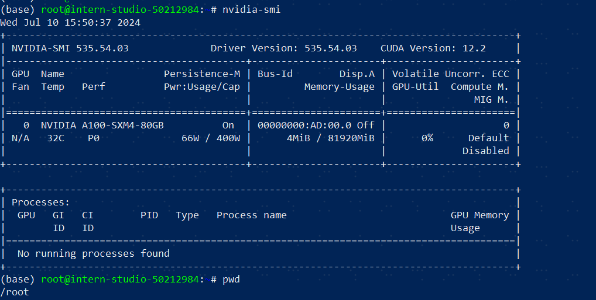
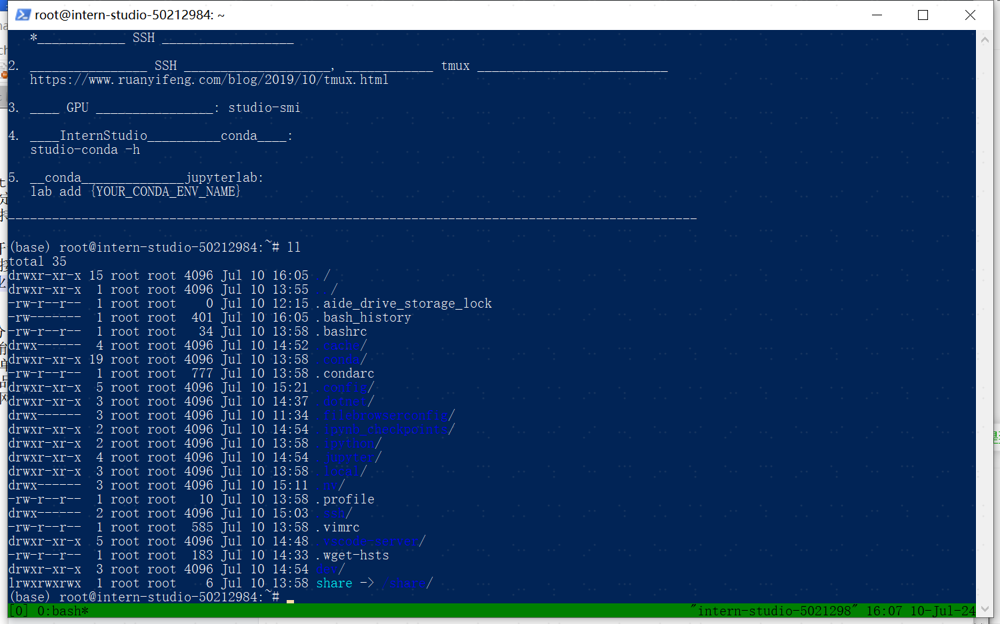
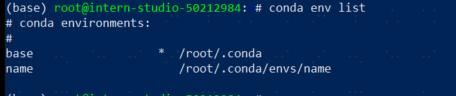

# Linux基础及环境搭建

## 环境搭建
### 1、学员信息登记并领取算力资源，新建开发机，

### 2、并安装vscode IDE，与开发机进行SSH远程连接

### 3、本地与开发机端口映射

## Linux 基础命令
### 1、熟悉linux的常用命令，通过powershell进行SSH远程登录服务器，查看显卡资源占用较低、功耗较低

### 2、备份到个人飞书文档备后续使用：https://gcng8154fkm3.feishu.cn/docx/QY1DdkV8foxKLLxE7z6cc2AJnDf

### 3、安装并使用tmux

## 学习conda设置及环境管理，并安装conda虚拟环境

