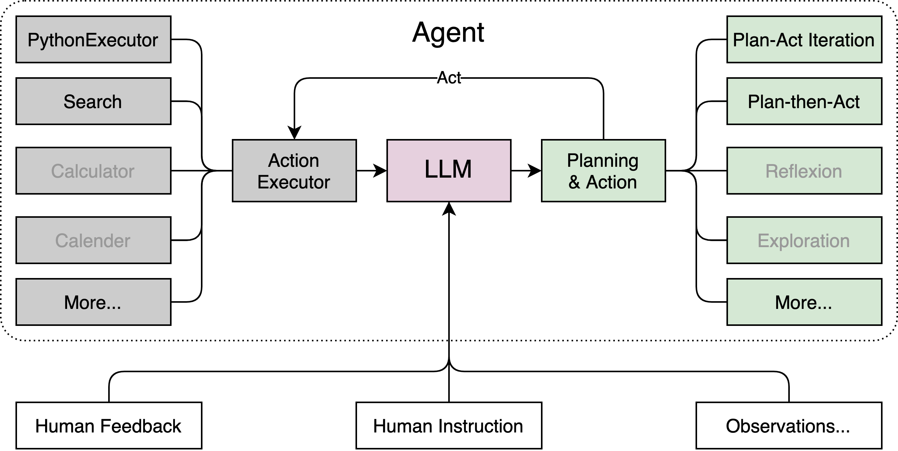

# 轻松玩转书生·浦语大模型趣味 Demo

## 1 大模型及 InternLM 模型简介
### 1.1 大模型简介
大模型，全称「大语言模型」，英文「Large Language Model」，缩写「LLM」。  
大模型的优势在于其能够捕捉和理解数据中更为复杂、抽象的特征和关系。按格式输出、分类聚类、生成文本、翻译、问答、对话等任务，大模型都能表现出色。大模型的应用场景非常广泛，包括但不限于：  
- 自然语言处理：如机器翻译、文本生成、情感分析、问答系统等。  
- 计算机视觉：如图像识别、物体检测、图像生成等。  
- 语音识别：如语音转文字、语音合成等。  
通过大规模参数的学习，它们可以提高在各种任务上的泛化能力，并在未经过大量特定领域数据训练的情况下实现较好的表现。然而，大模型也面临着一些挑战，比如巨大的计算资源需求、高昂的训练成本、对大规模数据的依赖以及模型的可解释性等问题。因此，大模型的应用和发展也需要在性能、成本和道德等多个方面进行权衡和考量。
### 1.2 大模型的运行机制
大模型根据上文及上上文及上上文的结果，猜下一个词（的概率），目前主流模型的算法采用 transformer，我们问问题的时候可以发现各种chat都是一个字一个字的返回

### 1.3 InternLM 模型简介
InternLM 是一个开源的轻量级训练框架，旨在支持大模型训练而无需大量的依赖。通过单一的代码库，它支持在拥有数千个 GPU 的大型集群上进行预训练，并在单个 GPU 上进行微调，同时实现了卓越的性能优化。在 1024 个 GPU 上训练时，InternLM 可以实现近 90% 的加速效率。  
基于 InternLM 训练框架，上海人工智能实验室已经发布了两个开源的预训练模型：InternLM-7B 和 InternLM-20B。
### 1.4 Lagent 简介
Lagent 是一个轻量级、开源的基于大语言模型的智能体（agent）框架，支持用户快速地将一个大语言模型转变为多种类型的智能体，并提供了一些典型工具为大语言模型赋能。通过 Lagent 框架可以更好的发挥 InternLM 的全部性能。


## 2 通用环境配置
### 2.1 pip、conda 换源
更多详细内容可移步至 [MirrorZ Help](https://help.mirrors.cernet.edu.cn/) 查看。
- 2.1.1 pip 换源
临时使用镜像源安装，如下所示：some-package 为你需要安装的包名
```bash
pip install -i https://mirrors.cernet.edu.cn/pypi/web/simple some-package
```
设置pip默认镜像源，升级 pip 到最新的版本 (>=10.0.0) 后进行配置，如下所示：
```bash
python -m pip install --upgrade pip
pip config set global.index-url https://mirrors.cernet.edu.cn/pypi/web/simple
```
如果您的 pip 默认源的网络连接较差，临时使用镜像源升级 pip：
```bash
python -m pip install -i https://mirrors.cernet.edu.cn/pypi/web/simple --upgrade pip
```
- 2.1.2 conda 换源  
镜像站提供了 Anaconda 仓库与第三方源（conda-forge、msys2、pytorch 等），各系统都可以通过修改用户目录下的 .condarc 文件来使用镜像站。  
不同系统下的 .condarc 目录如下：
    - Linux: ${HOME}/.condarc
    - macOS: ${HOME}/.condarc
    - Windows: C:\Users\<YourUserName>\.condarc  

    注意：Windows 用户无法直接创建名为 .condarc 的文件，可先执行 conda config --set show_channel_urls yes 生成该文件之后再修改。
    快速配置
    ```
    cat <<'EOF' > ~/.condarc
    channels:
    - defaults
    show_channel_urls: true
    default_channels:
    - https://mirrors.tuna.tsinghua.edu.cn/anaconda/pkgs/main
    - https://mirrors.tuna.tsinghua.edu.cn/anaconda/pkgs/r
    - https://mirrors.tuna.tsinghua.edu.cn/anaconda/pkgs/msys2
    custom_channels:
    conda-forge: https://mirrors.tuna.tsinghua.edu.cn/anaconda/cloud
    pytorch: https://mirrors.tuna.tsinghua.edu.cn/anaconda/cloud
    EOF
    ```
### 2.2 配置本地端口
由于服务器通常只暴露了用于安全远程登录的 SSH（Secure Shell）端口，如果需要访问服务器上运行的其他服务（如 web 应用）的特定端口，需要一种特殊的设置。我们可以通过使用SSH隧道的方法，将服务器上的这些特定端口映射到本地计算机的端口。这样做的步骤如下：  

首先我们需要配置一下本地的 SSH Key ，我们这里以 Windows 为例。

步骤①：在本地机器上打开 Power Shell 终端。在终端中，运行以下命令来生成 SSH 密钥对：（如下图所示）
```bash
ssh-keygen -t rsa
```
步骤②： 您将被提示选择密钥文件的保存位置，默认情况下是在 ~/.ssh/ 目录中。按 Enter 键接受默认值或输入自定义路径。

步骤③：公钥默认存储在 ~/.ssh/id_rsa.pub，可以通过系统自带的 cat 工具查看文件内容：（如下图所示）
```bash
cat ~\.ssh\id_rsa.pub
```
    ~ 是用户主目录的简写，.ssh 是SSH配置文件的默认存储目录，id_rsa.pub 是 SSH 公钥文件的默认名称。所以，cat ~\.ssh\id_rsa.pub 的意思是查看用户主目录下的 .ssh 目录中的 id_rsa.pub 文件的内容。

步骤④：将公钥复制到剪贴板中，然后回到 InternStudio 控制台，点击配置 SSH Key。将刚刚复制的公钥添加进入即可。
步骤⑥：在本地终端输入以下指令 .6006 是在服务器中打开的端口，而 33090 是根据开发机的端口进行更改。如下图所示：
```bash
ssh -CNg -L 6006:127.0.0.1:6006 root@ssh.intern-ai.org.cn -p 33090
```

### 2.3 模型下载
#### 2.3.1 Hugging Face
使用 Hugging Face 官方提供的 huggingface-cli 命令行工具。安装依赖:
```bash
pip install -U huggingface_hub
```
然后新建 python 文件，填入以下代码，运行即可。
- resume-download：断点续下
- local-dir：本地存储路径。（linux 环境下需要填写绝对路径）
```python
import os

# 下载模型
os.system('huggingface-cli download --resume-download internlm/internlm-chat-7b --local-dir your_path')
```
以下内容将展示使用 huggingface_hub 下载模型中的部分文件
```python
import os 
from huggingface_hub import hf_hub_download  # Load model directly 

hf_hub_download(repo_id="internlm/internlm-7b", filename="config.json")
```
#### 2.3.2 ModelScope
使用 modelscope 中的 snapshot_download 函数下载模型，第一个参数为模型名称，参数 cache_dir 为模型的下载路径。  
注意：cache_dir 最好为绝对路径。  
安装依赖：
```bash
pip install modelscope==1.9.5
pip install transformers==4.35.2
```
在当前目录下新建 python 文件，填入以下代码，运行即可。
```python
import torch
from modelscope import snapshot_download, AutoModel, AutoTokenizer
import os
model_dir = snapshot_download('Shanghai_AI_Laboratory/internlm-chat-7b', cache_dir='your path', revision='master')
```
#### 2.3.3 OpenXLab
OpenXLab 可以通过指定模型仓库的地址，以及需要下载的文件的名称，文件所需下载的位置等，直接下载模型权重文件。  

使用python脚本下载模型首先要安装依赖，安装代码如下：pip install -U openxlab 安装完成后使用 download 函数导入模型中心的模型。
```python
from openxlab.model import download
download(model_repo='OpenLMLab/InternLM-7b', model_name='InternLM-7b', output='your local path')
```

## 3 模型部署实践案例demo
### 3.1 InternLM-Chat-7B 智能对话 Demo
### 3.2 Lagent 智能体工具调用 Demo
### 3.3 浦语·灵笔图文理解创作 Demo


## 作业

