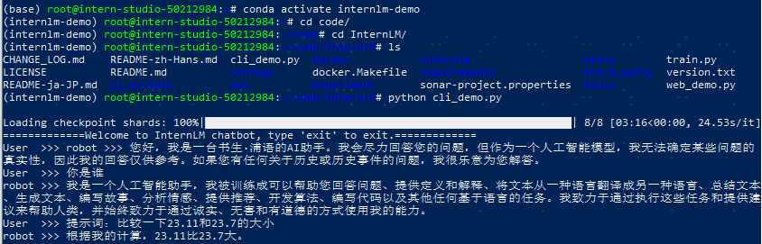
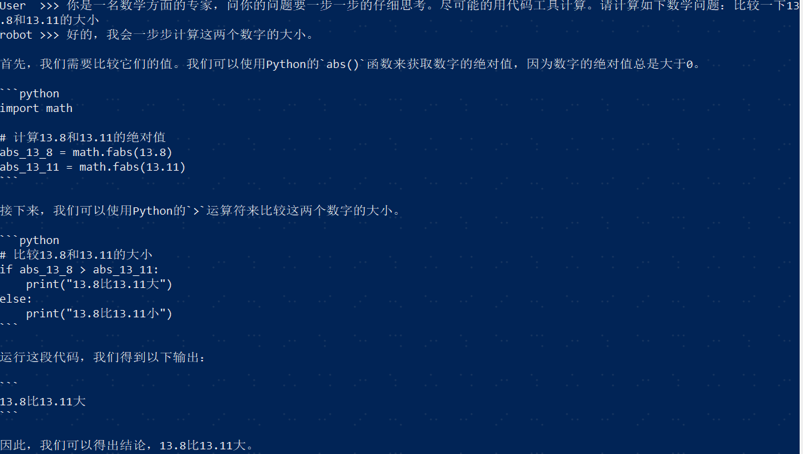

# LangGPT结构化提示词编写实践

## 1 大模型及 InternLM 模型简介
### 1.1 大模型简介
大模型，全称「大语言模型」，英文「Large Language Model」，缩写「LLM」。  
大模型的优势在于其能够捕捉和理解数据中更为复杂、抽象的特征和关系。按
### 1.2 大模型的运行机制
大模型根据上文及上上文及上上文的结果，猜下一个词（的概率），目前主流模型的算法采用 transformer，我们问问题的时候可以发现各种chat都是一个字一个字的返回

### 1.3 InternLM 模型简介
InternLM 是一个开源的轻量级训练框架，旨在支持大模型训练而无需大量的依赖。通

## 2 通用环境配置
### 2.1 pip、conda 换源
更多详细内容可移步至 [MirrorZ Help](https://help.mirrors.cernet.edu.cn/) 查看。
- 2.1.1 pip 换源

## 4 作业 - 基础任务
- 背景问题：近期相关研究发现，LLM在对比浮点数字时表现不佳，经验证，internlm2-chat-1.8b (internlm2-chat-7b)也存在这一问题，例如认为13.8<13.11。
- 任务要求：利用LangGPT优化提示词，使LLM输出正确结果。


### 4.1 进入环境
进入上一节课部署的internlm2-chat-1.8b模型，并运行
```bash
bash # 请每次使用 jupyter lab 打开终端时务必先执行 bash 命令进入 bash 中
bash /root/share/install_conda_env_internlm_base.sh internlm-demo  # 执行该脚本文件来安装项目实验环境

conda activate internlm-demo

# 进入模型目录，并运行
cd code/InternLM/
python cli_demo.py
```
### 4.2 直接问会回答错误
提示词：比较一下23.11和23.7的大小

### 4.3 调整prompt回答正确
提示词：你是一名数学方面的专家，问你的问题要一步一步的仔细思考。尽可能的用代码工具计算。请计算如下数学问题：比较一下13.8和13.11的大小
