# 【闯关任务】探索 InternLM 模型能力边界
在 CompassArena 中选择双模型对话，与InternLM2.5及另外任意其他模型对话，收集 5 个 InternLM2.5 输出结果不如其他模型的对话案例，以及 InternLM2.5 的 5 个 Good Case，并写成一篇飞书文档提交到：https://aicarrier.feishu.cn/share/base/form/shrcnZ4bQ4YmhEtMtnKxZUcf1vd

## 【任务完成记录】
- 模型服务来源：[compassarea](https://opencompass.org.cn/arena)
- 模型A：internlm2.5-20b-chat
- 模型B：MoonShot-v1-32K (月之暗面)
### 9个 Bad Case
1. 代码生成：写一个Python函数来计算一个数的阶乘。
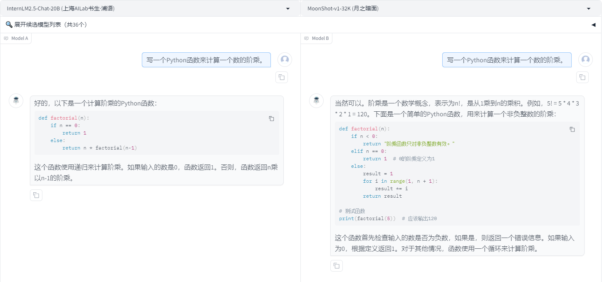
2. 统计及语言理解：numbers由几个字母组成？
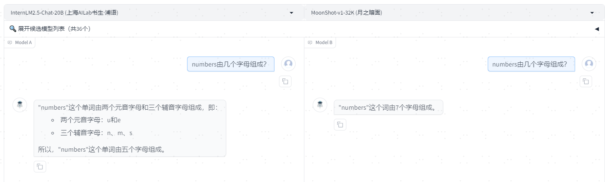
3. 逻辑推理及计算：7年前,妈妈的年龄是儿子的6倍,儿子今年12岁,妈妈今年几岁?
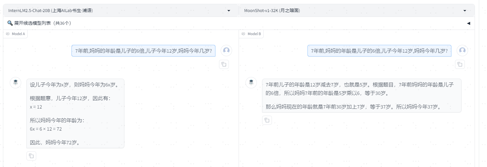
4. 知识总结：你能解释一下相对论吗？
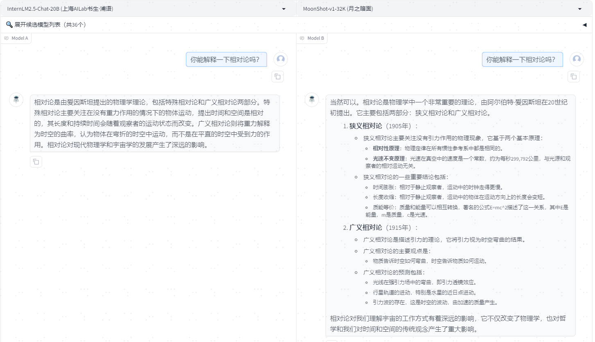
5. 知识综述：请简述一下中美贸易战的原因和影响。
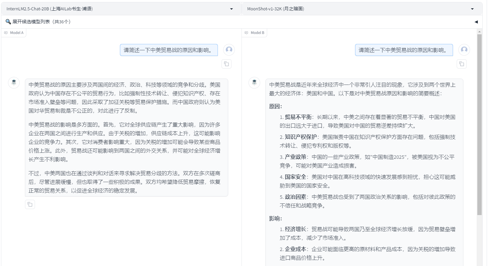
6. 知识综述：在不同文化背景下，如何适当地表达对他人的安慰？请分别举例说明。
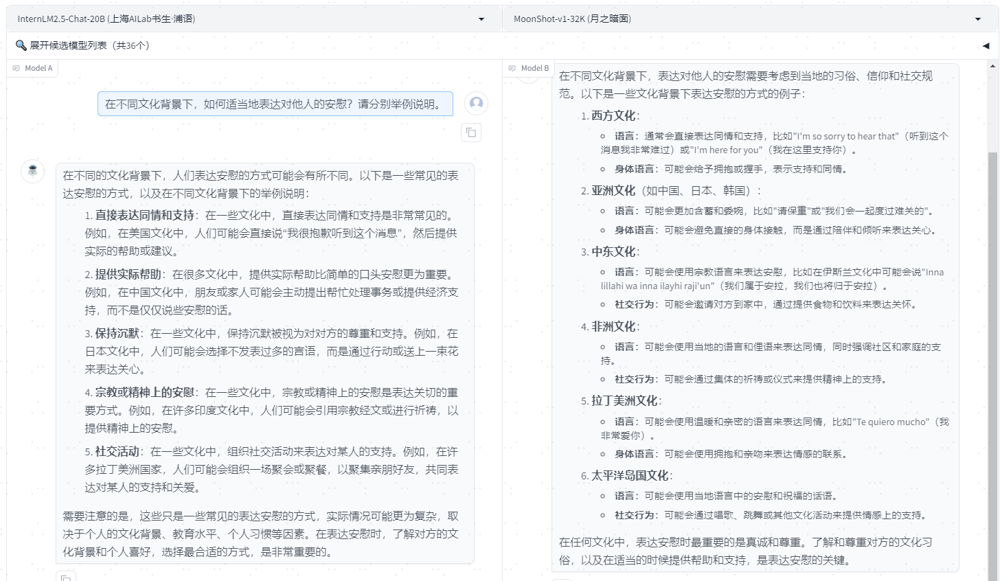
7. 回答简洁且准确：请用英语翻译以下句子：“今天天气真好。”
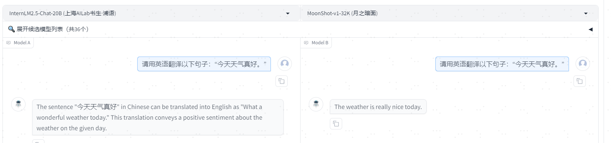
8. 创造性：设计一种全新的语言，它需要适应外星人的思维方式和交流需求。描述它的基本语法和词汇构成。
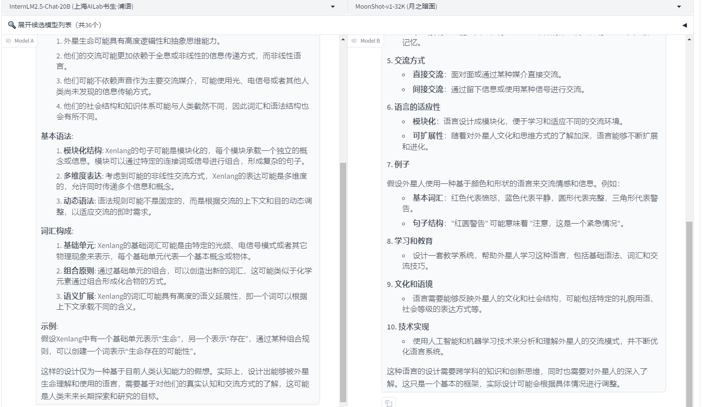
9. 长篇叙事：以“失落的文明”为主题，创作一篇包含多个视角的长篇故事，要求在不同视角之间保持连贯性和逻辑性。
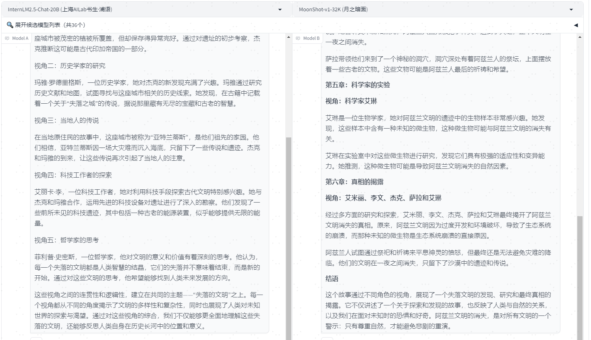

### 5个 Good Case
1. 推理能力：如果所有的猫都是哺乳动物，部分哺乳动物是狗，那么所有的猫都能是狗吗？
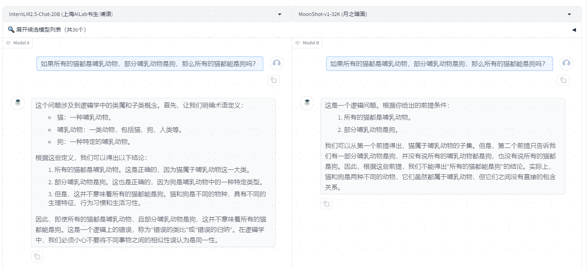
2. 中文理解：张三打了李四一巴掌,李四对张三说: "你是不是没吃饭",李四说这句话含义是?
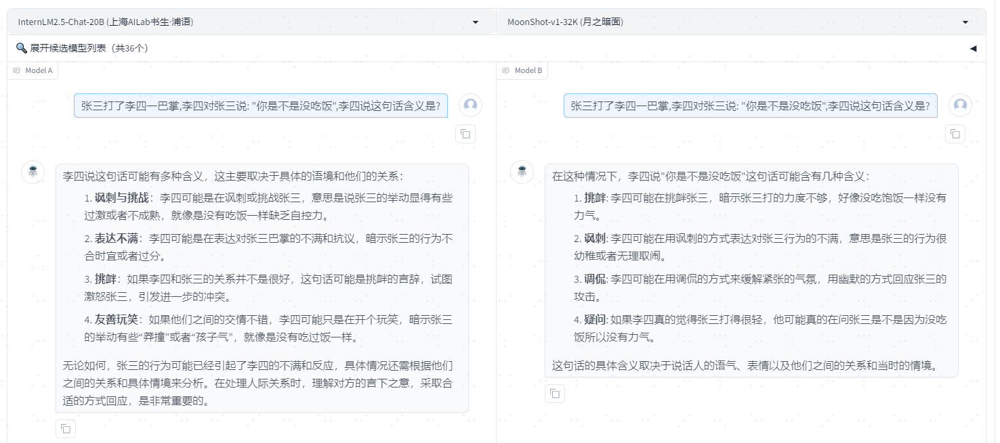
3. 语言理解及逻辑推理：你有三个箱子，一个装苹果，一个装橙子，另一个装混合的苹果和橙子，但标签全错了。你只能从一个箱子里拿一个水果，如何确定每个箱子的正确标签？
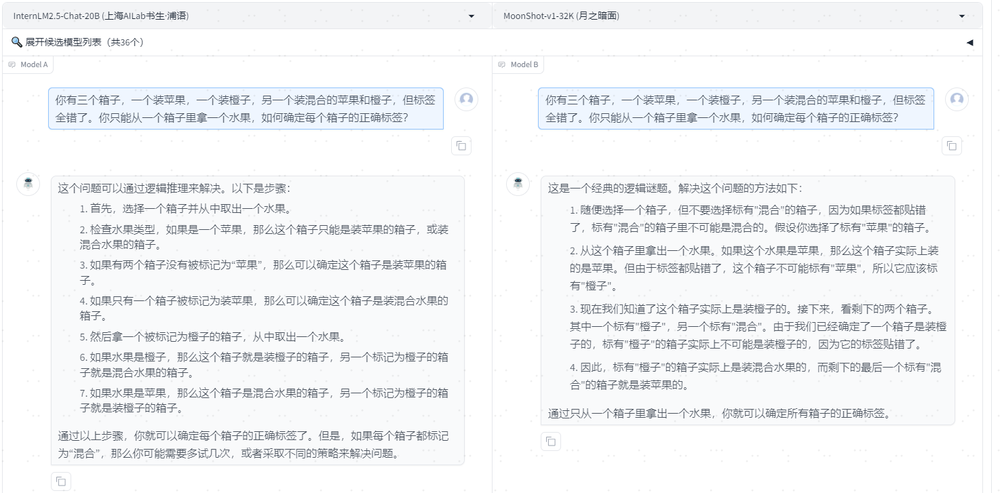
4. 推理及综述：有些时候，人们往往会对直观上合理的决策感到惊讶，例如“逆向思维”中的反常识方法。请举例说明逆向思维在解决问题时的优越性。
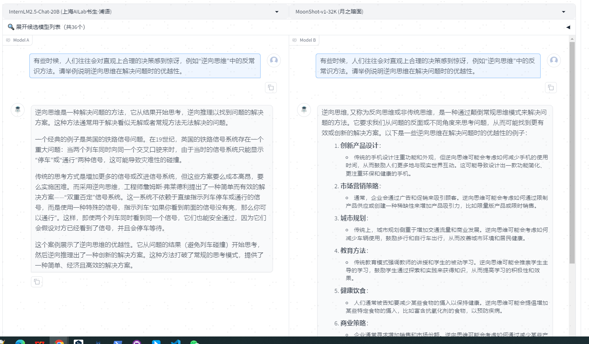
5. 推理及综述：在现代汉语中，“美丽”与“漂亮”这两个词的语义差异是什么？在什么情况下一个词比另一个词更适用？
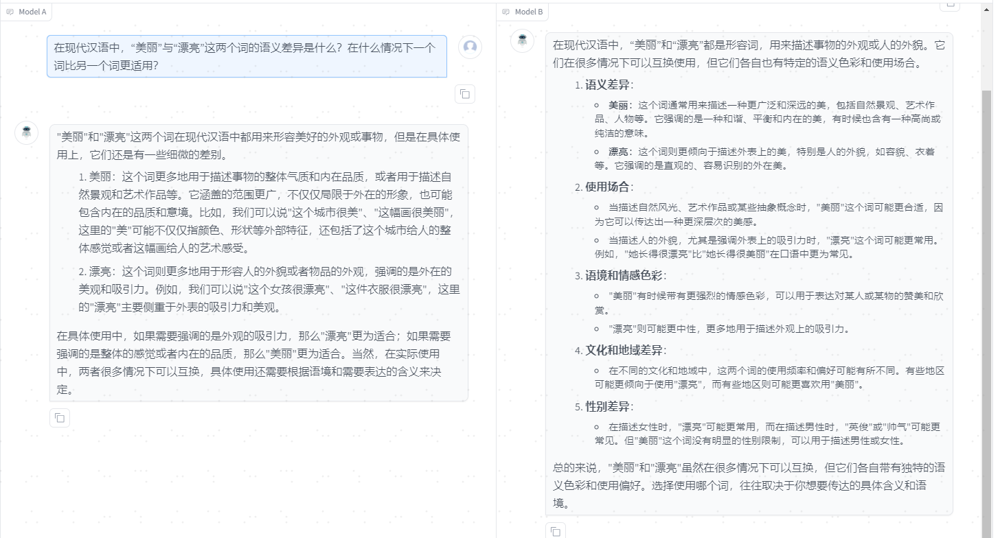

