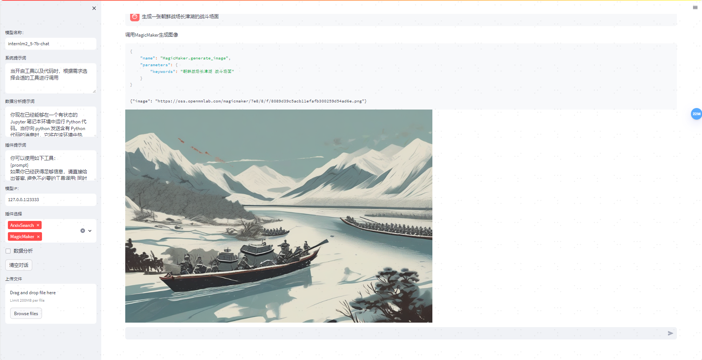

# 书生·浦语大模型全链路开源体系
参考资料：https://github.com/InternLM/Tutorial/blob/camp3/docs/L2/Lagent/readme.md

## 1 Lagent 介绍
Lagent 是一个轻量级开源智能体框架，旨在让用户可以高效地构建基于大语言模型的智能体。同时它也提供了一些典型工具以增强大语言模型的能力。
Lagent 目前已经支持了包括 AutoGPT、ReAct 等在内的多个经典智能体范式，也支持了Google 搜索、Google 学术搜索、Arxiv 搜索、Bing 地图、Python 解释器、PPT等tools。
其基本结构如下所示：


## 2 Lagent Web Demo
### 2.1 基础环境配置
```bash
# 创建环境
conda create -n Lagent python=3.10 -y
# 激活环境
conda activate Lagent
# 安装 torch
conda install pytorch==2.1.2 torchvision==0.16.2 torchaudio==2.1.2 pytorch-cuda=12.1 -c pytorch -c nvidia -y
# 安装其他依赖包
pip install termcolor==2.4.0
pip install lmdeploy==0.5.2
pip install streamlit==1.24.0
```
### 2.2 源码安装的方式安装 lagent
- 切换路径到 /root/code 克隆 lagent 仓库，并通过 pip install -e . 源码安装 Lagent
```bash
cd /root/code
git clone https://github.com/InternLM/lagent.git
cd lagent && git checkout 81e7ace && pip install -e . && cd ..
```

### 2.3 Lagent Web Demo 使用
使用 Lagent 的 Web Demo 来体验 InternLM2.5-7B-Chat 的智能体能力。  
首先，我们先使用 LMDeploy 部署 InternLM2.5-7B-Chat，并启动一个 API Server。
```bash
lmdeploy serve api_server /share/new_models/Shanghai_AI_Laboratory/internlm2_5-7b-chat --model-name internlm2_5-7b-chat
```
在另一个窗口通过streamlit 启动Lagent的Web Demo
```bash
streamlit run /root/code/lagent/examples/internlm2_agent_web_demo.py
```

配置端口映射（ssh -CNg -L 8501:127.0.0.1:8501 root@ssh.intern-ai.org.cn -p 42678 ）后，就可以在本地通过浏览器访问：http://127.0.0.1:8501 来进行对话了。  
有个header兼容性报错，注释掉demo中的代码后正常运行

接下来修改模型名称一栏为 internlm2_5-7b-chat，修改模型 ip一栏为127.0.0.1:23333。(输入后需要按下回车以确认！)  
在插件选择一栏选择 ArxivSearch，并输入指令“帮我搜索一下 MindSearch 论文”。


## 3 基于 Lagent 自定义智能体
官方文档：https://lagent.readthedocs.io/zh-cn/latest/tutorials/action.html
### 3.1 Lagent 自定义工具流程步骤
1. 继承 BaseAction 类
2. 实现简单工具的 run 方法；或者实现工具包内每个子工具的功能
3. 简单工具的 run 方法可选被 tool_api 装饰；工具包内每个子工具的功能都需要被 tool_api 装饰
### 3.2 案例-调用 MagicMaker API 以完成文生图的功能
在目录/root/code/lagent/lagent/actions/下，创建python脚本文件magicmaker.py，输入代码
<details>
    <summary>lagent_magicmaker.py代码</summary>
    ```python
        import json
        import requests

        from lagent.actions.base_action import BaseAction, tool_api
        from lagent.actions.parser import BaseParser, JsonParser
        from lagent.schema import ActionReturn, ActionStatusCode


        class MagicMaker(BaseAction):
            styles_option = [
                'dongman',  # 动漫
                'guofeng',  # 国风
                'xieshi',   # 写实
                'youhua',   # 油画
                'manghe',   # 盲盒
            ]
            aspect_ratio_options = [
                '16:9', '4:3', '3:2', '1:1',
                '2:3', '3:4', '9:16'
            ]

            def __init__(self,
                        style='guofeng',
                        aspect_ratio='4:3'):
                super().__init__()
                if style in self.styles_option:
                    self.style = style
                else:
                    raise ValueError(f'The style must be one of {self.styles_option}')
                
                if aspect_ratio in self.aspect_ratio_options:
                    self.aspect_ratio = aspect_ratio
                else:
                    raise ValueError(f'The aspect ratio must be one of {aspect_ratio}')
            
            @tool_api
            def generate_image(self, keywords: str) -> dict:
                """Run magicmaker and get the generated image according to the keywords.

                Args:
                    keywords (:class:`str`): the keywords to generate image

                Returns:
                    :class:`dict`: the generated image
                        * image (str): path to the generated image
                """
                try:
                    response = requests.post(
                        url='https://magicmaker.openxlab.org.cn/gw/edit-anything/api/v1/bff/sd/generate',
                        data=json.dumps({
                            "official": True,
                            "prompt": keywords,
                            "style": self.style,
                            "poseT": False,
                            "aspectRatio": self.aspect_ratio
                        }),
                        headers={'content-type': 'application/json'}
                    )
                except Exception as exc:
                    return ActionReturn(
                        errmsg=f'MagicMaker exception: {exc}',
                        state=ActionStatusCode.HTTP_ERROR)
                image_url = response.json()['data']['imgUrl']
                return {'image': image_url}
    ```
</details>

然后修改 /root/code/lagent/examples/internlm2_agent_web_demo.py 来适配我们的自定义工具。
>1. 在 from lagent.actions import ActionExecutor, ArxivSearch, IPythonInterpreter 的下一行添加 from lagent.actions.magicmaker import MagicMaker
>2. 在第27行添加 MagicMaker()。
重新启动web demo，修改模型名称一栏为 internlm2_5-7b-chat，修改模型 ip一栏为127.0.0.1:23333。(输入后需要按下回车以确认！)  。选择两个插件后，输入“请帮我生成一幅山水画”


## 4 作业 - 基础任务
使用 Lagent 自定义一个智能体，并使用 Lagent Web Demo 成功部署与调用，记录复现过程并截图。


详细过程参见：[3.2章节](#32-案例-调用-magicmaker-api-以完成文生图的功能)

