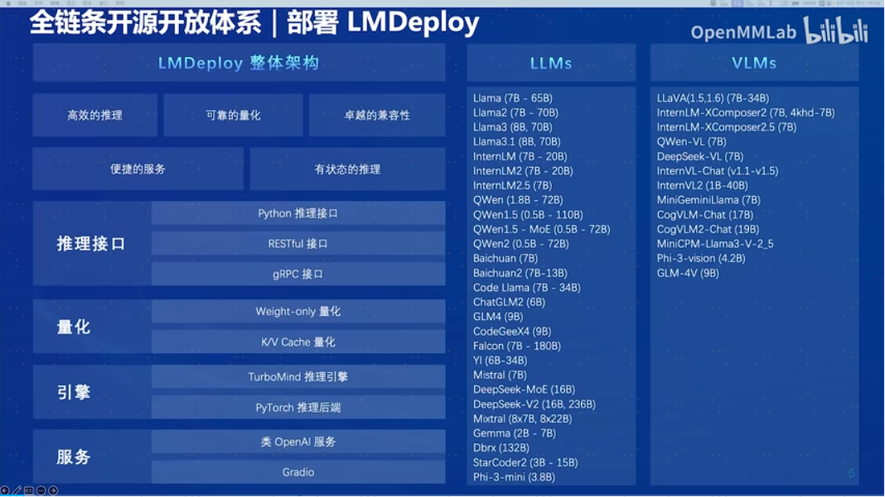
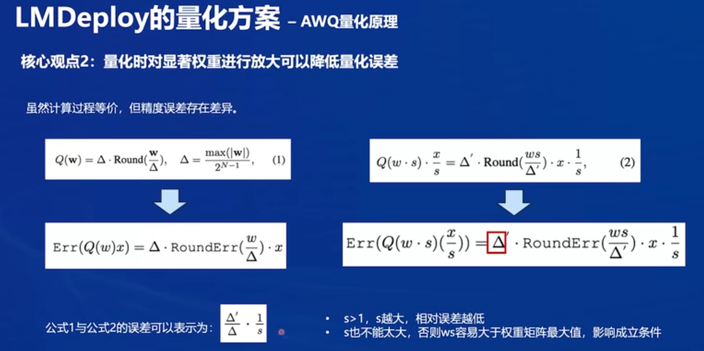
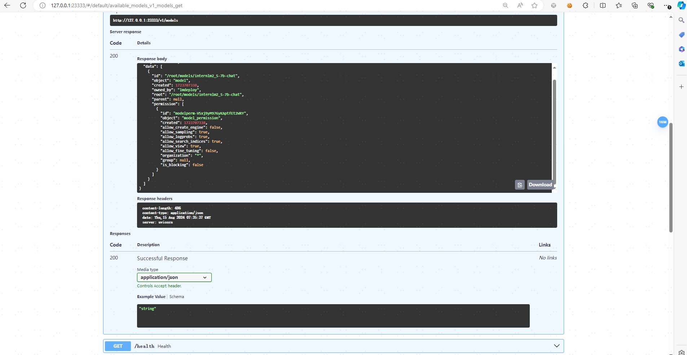

# LMDeploy 量化部署实践

## 1 基础知识介绍
### LMDeploy部署体系:

### 大模型缓存推理技术：

### 大模型量化技术：

### LMDeploy量化方案：


模型量化是一种优化技术，旨在减少机器学习模型的大小并提高其推理速度。量化通过将模型的权重和激活从高精度（如16位浮点数）转换为低精度（如8位整数、4位整数、甚至二值网络）来实现。  
W4A16的含义是：
- W4：这通常表示权重量化为4位整数（int4）。这意味着模型中的权重参数将从它们原始的浮点表示（例如FP32、BF16或FP16，Internlm2.5精度为BF16）转换为4位的整数表示。这样做可以显著减少模型的大小。
- A16：这表示激活（或输入/输出）仍然保持在16位浮点数（例如FP16或BF16）。激活是在神经网络中传播的数据，通常在每层运算之后产生。

因此，W4A16的量化配置意味着：
- 权重被量化为4位整数。
- 激活保持为16位浮点数。  

### LMDeploy量化方案-AWQ量化原理：


  


### 大模型外推技术


Function Calling


## 2 配置LMDeploy环境
### 2.1 创建开发机:
新建--个人开发机--开发机名称：XTuner微调--镜像Cuda12.2-conda--资源配置选择30%A100
```bash
# 创建环境
conda create -n lmdeploy  python=3.10 -y
conda activate lmdeploy
conda install pytorch==2.1.2 torchvision==0.16.2 torchaudio==2.1.2 pytorch-cuda=12.1 -c pytorch -c nvidia -y
pip install timm==1.0.8 openai==1.40.3 lmdeploy[all]==0.5.3
```
### 2.2 InternStudio环境获取模型
软链方式：
```bash
ln -s /root/share/new_models//Shanghai_AI_Laboratory/internlm2_5-7b-chat /root/models
ln -s /root/share/new_models/OpenGVLab/InternVL2-26B /root/models
```
### 2.3 LMDeploy API部署InternLM2.5
启动API服务器，部署InternLM2.5模型：
```bash
lmdeploy serve api_server /root/models/internlm2_5-7b-chat --model-format hf --quant-policy 0 --server-name 0.0.0.0 --server-port 23333 --tp 1
```
命令解释

配置端口映射（ssh -CNg -L 23333:127.0.0.1:23333 root@ssh.intern-ai.org.cn -p 48466 ）后，就可以在本地通过浏览器访问：http://127.0.0.1:23333 swagger api。

通过如下命令可启动server服务：
```bash
lmdeploy serve api_client http://localhost:23333
```

### 2.4 以Gradio网页形式连接API服务器
启动API服务器，部署InternLM2.5模型：
```bash
lmdeploy serve gradio http://localhost:23333 --server-name 0.0.0.0 --server-port 6006
```
重新配置端口映射（ssh -CNg -L 6006:127.0.0.1:6006 root@ssh.intern-ai.org.cn -p 48466 ）后，就可以在本地通过浏览器访问：http://127.0.0.1:6006 web页面。


## 3 LMDeploy Lite
随着模型变得越来越大，我们需要一些大模型压缩技术来降低模型部署的成本，并提升模型的推理性能。LMDeploy 提供了权重量化和 k/v cache两种策略。
### 3.1 设置最大kv cache缓存大小
```bash
lmdeploy chat /root/models/internlm2_5-7b-chat --cache-max-entry-count 0.4
```
查看显存占用情况：

对比之前不设置kv cache时的显存占用情况：

观测显存占用情况，可以看到通过设置设置kv cache减少了约4GB的显存。

### 3.2 设置在线 kv cache int4 量化
通过int4参数启动部署InternLM2.5模型：
```bash
lmdeploy serve api_server /root/models/internlm2_5-7b-chat --model-format hf --quant-policy 0 --cache-max-entry-count 0.4 --server-name 0.0.0.0 --server-port 23333 --tp 1
```
观测显存占用情况：

那么本节中19GB的显存占用与[2.2.1 设置最大kv cache缓存大小](#2.2.1 23)中19GB的显存占用区别何在呢？  

由于都使用BF16精度下的internlm2.5 7B模型，故剩余显存均为10GB，且 cache-max-entry-count 均为0.4，这意味着LMDeploy将分配40%的剩余显存用于kv cache，即10GB*0.4=4GB。但quant-policy 设置为4时，意味着使用int4精度进行量化。因此，LMDeploy将会使用int4精度提前开辟4GB的kv cache。  

相比使用BF16精度的kv cache，int4的Cache可以在相同4GB的显存下只需要4位来存储一个数值，而BF16需要16位。这意味着int4的Cache可以存储的元素数量是BF16的四倍。

### 3.3 W4A16模型量化和部署
LMDeploy使用的是AWQ算法，能够实现模型的4bit权重量化。输入以下指令，执行量化工作。
```bash
lmdeploy lite auto_awq \
   /root/models/internlm2_5-7b-chat \
  --calib-dataset 'ptb' \
  --calib-samples 128 \
  --calib-seqlen 2048 \
  --w-bits 4 \
  --w-group-size 128 \
  --batch-size 1 \
  --search-scale False \
  --work-dir /root/models/internlm2_5-7b-chat-w4a16-4bit
```
命令解释：

正在推理中：

推理完成，生成文件：  
  
查看文件夹大小，对比量化后模型只有4.9G， 小了三倍

执行 lmdeploy chat /root/models/internlm2_5-7b-chat-w4a16-4bit/ --model-format awq 启动量化后的模型，查看显存占用情况：

可以发现，相比较于原先的23GB显存占用，W4A16量化后的模型少了约2GB的显存占用。

### 3.4 W4A16 量化+ KV cache+KV cache 量化
输入以下指令，即可同时启用量化后的模型、设定kv cache占用和kv cache int4量化。
```bash
lmdeploy serve api_server \
    /root/models/internlm2_5-7b-chat-w4a16-4bit/ \
    --model-format awq \
    --quant-policy 4 \
    --cache-max-entry-count 0.4\
    --server-name 0.0.0.0 \
    --server-port 23333 \
    --tp 1
```
查看显存占用情况，此时显存占用13.5GB：


## 4 LMDeploy与InternVL2（多模态大模型量化部署）
本次实践选用InternVL2-26B进行演示，其实就根本来说作为一款VLM和上述的InternLM2.5在操作上并无本质区别，仅是多出了"图片输入"这一额外步骤，但作为量化部署进阶实践，选用InternVL2-26B目的是带领大家体验一下LMDeploy的量化部署可以做到何种程度。
### 4.1 LMDeploy Lite
InternVL2-26B需要约70+GB显存，但是为了让我们能够在30%A100上运行，需要先进行量化操作，这也是量化本身的意义所在——即降低模型部署成本。
### 4.2 W4A16 模型量化和部署
针对InternVL系列模型，让我们先进入conda环境，并输入以下指令，执行模型的量化工作。
```bash
conda activate lmdeploy
lmdeploy lite auto_awq \
   /root/models/InternVL2-26B \
  --calib-dataset 'ptb' \
  --calib-samples 128 \
  --calib-seqlen 2048 \
  --w-bits 4 \
  --w-group-size 128 \
  --batch-size 1 \
  --search-scale False \
  --work-dir /root/models/InternVL2-26B-w4a16-4bit
```
本步骤耗时较长，30%A100会报错显存溢出（CUDA out of memory）。升级到50%A100(也可以降低参数calib-seqlen的值到1024)，参数batch-size设置为10提升并行处理，等待推理完成，便可以在左侧/models内直接看到对应的模型文件。


### 4.3  启动量化后的InternVL2-26B-w4a16-4bit模型
输入以下指令启动部署量化后的模型：
```bash
lmdeploy serve api_server \
    /root/models/InternVL2-26B-w4a16-4bit \
    --model-format awq \
    --quant-policy 4 \
    --cache-max-entry-count 0.1\
    --server-name 0.0.0.0 \
    --server-port 23333 \
    --tp 1
```
开启50%A100进行模型部署：


### 4.4  LMDeploy API部署InternVL2
通过以下命令启动API服务器，部署InternVL2模型：
```bash
lmdeploy serve api_server \
    /root/models/InternVL2-26B-w4a16-4bit/ \
    --model-format awq \
    --quant-policy 4 \
    --cache-max-entry-count 0.6 \
    --server-name 0.0.0.0 \
    --server-port 23333 \
    --tp 1
```
启动web页面：
```bash
lmdeploy serve gradio http://localhost:23333 --server-name 0.0.0.0 --server-port 6006
```
重新配置端口映射（ssh -CNg -L 6006:127.0.0.1:6006 root@ssh.intern-ai.org.cn -p 48466 ）后，就可以在本地通过浏览器访问：http://127.0.0.1:6006 web页面：

该webdemo没有多模态输入，如果评测图片解析能力需要在做demo。

## 5 作业 - 基础任务
### 5.1 使用结合W4A16量化与kv cache量化的internlm2_5-7b-chat模型封装本地API并与大模型进行一次对话，作业截图需包括显存占用情况与大模型回复，参考4.1 API开发(优秀学员必做)
1. 进入创建好的conda环境并输入指令启动API服务器。
```bash
conda activate lmdeploy
lmdeploy serve api_server \
    /root/models/internlm2_5-7b-chat-w4a16-4bit \
    --model-format awq \
    --cache-max-entry-count 0.4 \
    --quant-policy 4 \
    --server-name 0.0.0.0 \
    --server-port 23333 \
    --tp 1
```
2. 新建internlm2_5-api-test.py文件，并输入以下代码：
<details>
    <summary>internlm2_5-api-test.py代码</summary>
    ```python
    # 导入openai模块中的OpenAI类，这个类用于与OpenAI API进行交互
    from openai import OpenAI


    # 创建一个OpenAI的客户端实例，需要传入API密钥和API的基础URL
    client = OpenAI(
        api_key='YOUR_API_KEY',  
        # 替换为你的OpenAI API密钥，由于我们使用的本地API，无需密钥，任意填写即可
        base_url="http://0.0.0.0:23333/v1"  
        # 指定API的基础URL，这里使用了本地地址和端口
    )

    # 调用client.models.list()方法获取所有可用的模型，并选择第一个模型的ID
    # models.list()返回一个模型列表，每个模型都有一个id属性
    model_name = client.models.list().data[0].id

    # 使用client.chat.completions.create()方法创建一个聊天补全请求
    # 这个方法需要传入多个参数来指定请求的细节
    response = client.chat.completions.create(
      model=model_name,  
      # 指定要使用的模型ID
      messages=[  
      # 定义消息列表，列表中的每个字典代表一个消息
        {"role": "system", "content": "你是一个聊天小助手，上知天文下知地理，文采风扬。"},  
        # 系统消息，定义助手的行为
        {"role": "user", "content": "帮我讲述一个明朝时候外国人来旅游的小故事"},  
        # 用户消息，询问时间管理的建议
      ],
        temperature=0.8,  
        # 控制生成文本的随机性，值越高生成的文本越随机
        top_p=0.8  
        # 控制生成文本的多样性，值越高生成的文本越多样
    )

    # 打印出API的响应结果
    print(response.choices[0].message.content)
    ```
</details>

3. 运行python /root/dev/api/internlm2_5-api-test.py ，终端输出大模型输出结果：


### 5.2 使用Function call功能让大模型完成一次简单的"加"与"乘"函数调用，作业截图需包括大模型回复的工具调用情况，参考4.2 Function call(选做)
1. 进入创建好的conda环境并启动API服务器。
```bash
conda activate lmdeploy
lmdeploy serve api_server \
    /root/models/internlm2_5-7b-chat \
    --model-format hf \
    --quant-policy 0 \
    --server-name 0.0.0.0 \
    --server-port 23333 \
    --tp 1
```
目前LMDeploy在0.5.3版本中支持了对InternLM2, InternLM2.5和llama3.1这三个模型，本次选用InternLM2.5 封装API。
2. 新建internlm2_5_func.py文件，并输入以下代码：
<details>
    <summary>internlm2_5_func.py代码</summary>
    ```python
    from openai import OpenAI


    def add(a: int, b: int):
        return a + b


    def mul(a: int, b: int):
        return a * b

    tools = [{
        'type': 'function',
        'function': {
            'name': 'add',
            'description': 'Compute the sum of two numbers',
            'parameters': {
                'type': 'object',
                'properties': {
                    'a': {
                        'type': 'int',
                        'description': 'A number',
                    },
                    'b': {
                        'type': 'int',
                        'description': 'A number',
                    },
                },
                'required': ['a', 'b'],
            },
        }
    }, {
        'type': 'function',
        'function': {
            'name': 'mul',
            'description': 'Calculate the product of two numbers',
            'parameters': {
                'type': 'object',
                'properties': {
                    'a': {
                        'type': 'int',
                        'description': 'A number',
                    },
                    'b': {
                        'type': 'int',
                        'description': 'A number',
                    },
                },
                'required': ['a', 'b'],
            },
        }
    }]
    messages = [{'role': 'user', 'content': 'Compute (3+5)*2'}]

    client = OpenAI(api_key='YOUR_API_KEY', base_url='http://0.0.0.0:23333/v1')
    model_name = client.models.list().data[0].id
    response = client.chat.completions.create(
        model=model_name,
        messages=messages,
        temperature=0.8,
        top_p=0.8,
        stream=False,
        tools=tools)
    print(response)
    func1_name = response.choices[0].message.tool_calls[0].function.name
    func1_args = response.choices[0].message.tool_calls[0].function.arguments
    func1_out = eval(f'{func1_name}(**{func1_args})')
    print(func1_out)

    messages.append({
        'role': 'assistant',
        'content': response.choices[0].message.content
    })
    messages.append({
        'role': 'environment',
        'content': f'3+5={func1_out}',
        'name': 'plugin'
    })
    response = client.chat.completions.create(
        model=model_name,
        messages=messages,
        temperature=0.8,
        top_p=0.8,
        stream=False,
        tools=tools)
    print(response)
    func2_name = response.choices[0].message.tool_calls[0].function.name
    func2_args = response.choices[0].message.tool_calls[0].function.arguments
    func2_out = eval(f'{func2_name}(**{func2_args})')
    print(func2_out)
    ```
</details>

执行脚本 python /root/dev/api/internlm2_5_func.py,运行结果：


## 参考资料：
- https://github.com/InternLM/Tutorial/blob/camp3/docs/L2/LMDeploy/readme.md 
- https://www.bilibili.com/video/BV1df421q7cR/?spm_id_from=pageDriver&vd_source=41bb3262014ad3cc41c3d25409df19be  