# InternVL 微调实践闯关任务

## 1 基础知识介绍
InternVL 是一种用于多模态任务的深度学习模型，旨在处理和理解多种类型的数据输入，如图像和文本。它结合了视觉和语言模型，能够执行复杂的跨模态任务，比如图文匹配、图像描述生成等。通过整合视觉特征和语言信息，InternVL 可以在多模态领域取得更好的表现
### 多模态大模型
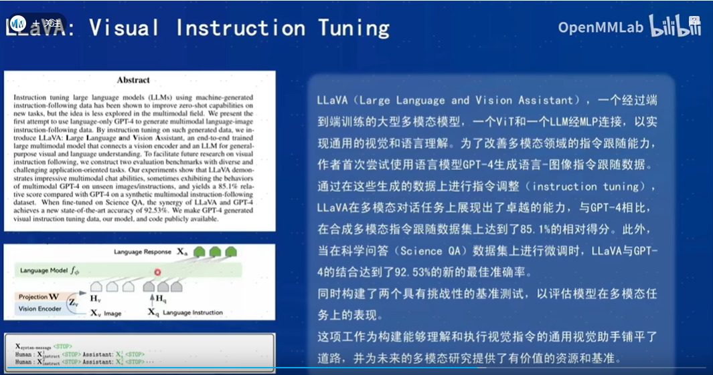
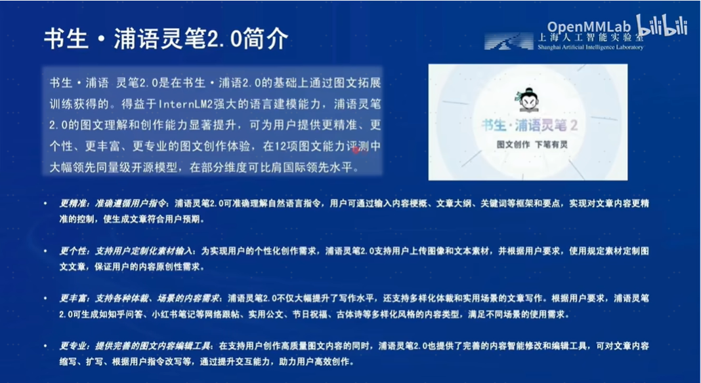
### 开源多模态语料库-书生万卷
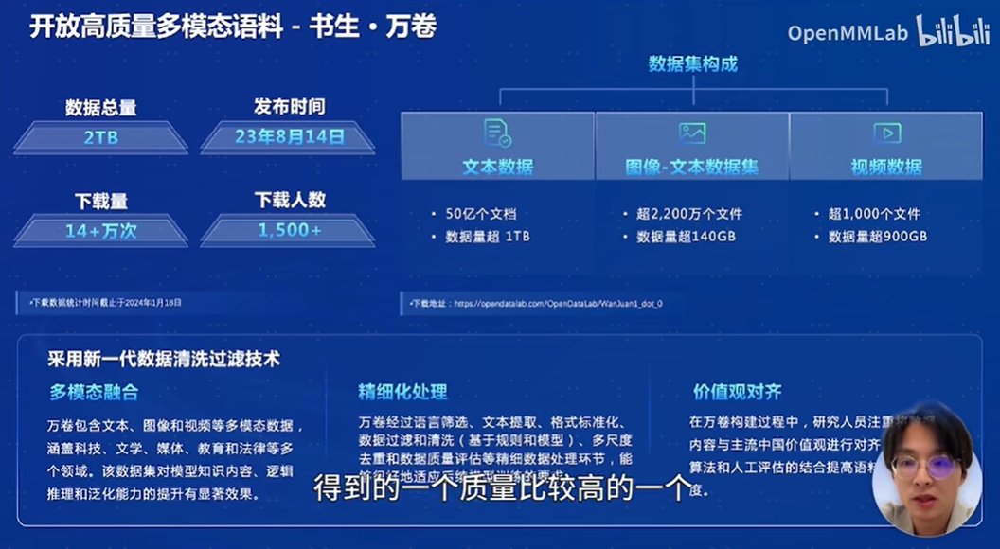
### 大模型微调理论
更详细介绍参考：[XTuner微调个人小助手认知](https://github.com/zdq5337/aicarrier_study/blob/main/%E5%9F%BA%E7%A1%80%E8%AF%BE/L1.5-XTuner%E5%BE%AE%E8%B0%83%E4%B8%AA%E4%BA%BA%E5%B0%8F%E5%8A%A9%E6%89%8B%E8%AE%A4%E7%9F%A5.md)
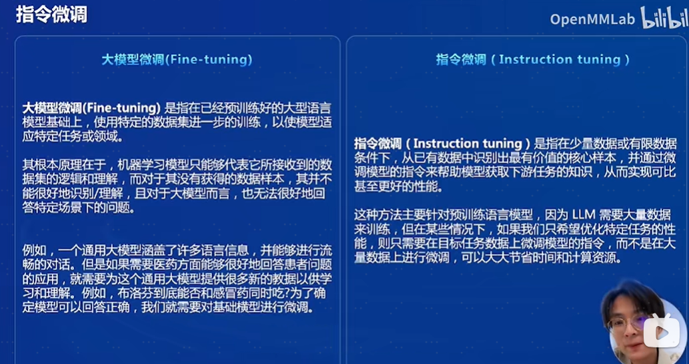

### InternVL模型总览
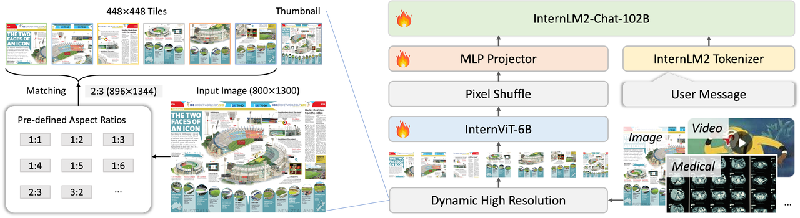
vision模块就是一个微调过的ViT，llm模块是一个InternLM的模型。对于视觉模块来说，它的特殊之处是InternVL独特的预处理模块(Dynamic High Resolution)：动态高分辨率，是为了让ViT模型能够尽可能获取到更细节的图像信息，提高视觉特征的表达能力。对于输入的图片，首先resize成448的倍数，然后按照预定义的尺寸比例从图片上crop对应的区域。
### Pixel Shuffle
Pixel Shuffle在超分任务中是一个常见的操作，PyTorch中有官方实现，即nn.PixelShuffle(upscale_factor) 该类的作用就是将一个tensor中的元素值进行重排列，假设tensor维度为[B, C, H, W], PixelShuffle操作不仅可以改变tensor的通道数，也会改变特征图的大小。

## 2 InternVL 部署微调实践
### 2.1 准备环境
配置虚拟环境
```bash
conda create --name xtuner python=3.10 -y

conda activate xtuner

# 安装一些必要的库
conda install pytorch==2.1.2 torchvision==0.16.2 torchaudio==2.1.2 pytorch-cuda=12.1 -c pytorch -c nvidia -y
# 安装其他依赖
apt install libaio-dev
pip install transformers==4.39.3 streamlit==1.36.0
```

### 2.2 安装Xtuner & 安装LMDeploy
```bash
# 创建一个目录，用来存放源代码
mkdir -p /root/InternLM/code & cd /root/InternLM/code

git clone -b v0.1.23  https://github.com/InternLM/XTuner

cd /root/InternLM/code/XTuner
pip install -e '.[deepspeed]'

pip install lmdeploy==0.5.3

# 安装验证
xtuner version
xtuner help
```
### 2.3 准备微调数据集
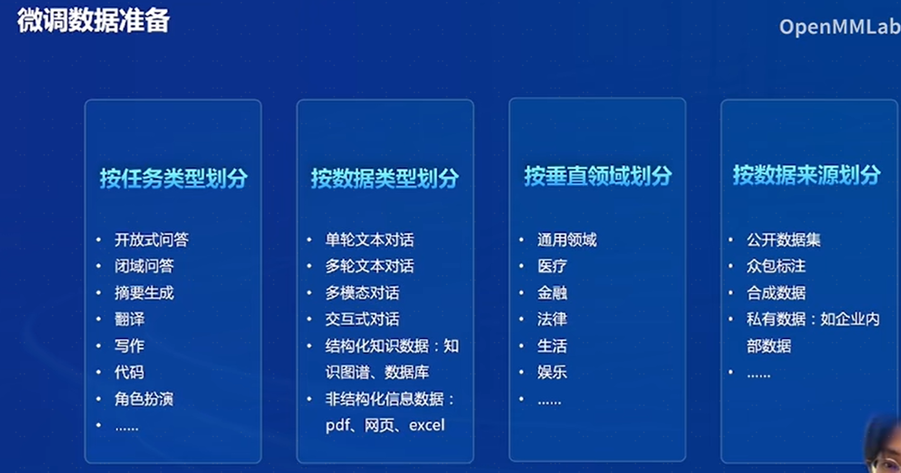
这里使用huggingface上的zhongshsh/CLoT-Oogiri-GO数据集，特别鸣谢!
```
@misc{zhong2023clot,
  title={Let's Think Outside the Box: Exploring Leap-of-Thought in Large Language Models with Creative Humor Generation},
  author={Zhong, Shanshan and Huang, Zhongzhan and Gao, Shanghua and Wen, Weushao and Lin, Liang and Zitnik, Marinka and Zhou, Pan},
  journal={arXiv preprint arXiv:2312.02439},
  year={2023}
}
```
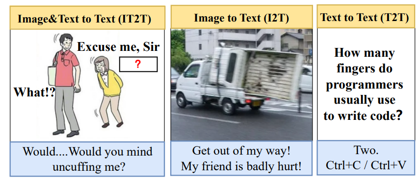
数据集我们从官网下载下来并进行去重，只保留中文数据等操作。并制作成XTuner需要的形式。并已在share里，我们一起从share里挪出数据集。
```bash
## 安装依赖包
pip install datasets matplotlib Pillow timm opencv-python opencv-python-headless python-dateutil

## 数据集迁移到个人目录
cp -r /root/share/new_models/datasets/CLoT_cn_2000 /root/InternLM/datasets/
```

## 3 InternVL 微调推理部署梗图实践
### 3.1 使用2B基座模型通过pipeline进行推理
使用lmdeploy自带的pipeline工具进行开箱即用的推理流程，首先新建一个文件。
```bash
touch /root/InternLM/code/test_lmdeploy.py
cd /root/InternLM/code/
```
然后把以下代码拷贝进test_lmdeploy.py中。
```python
from lmdeploy import pipeline
from lmdeploy.vl import load_image

pipe = pipeline('/root/model/InternVL2-2B')

image = load_image('/root/InternLM/007aPnLRgy1hb39z0im50j30ci0el0wm.jpg')
response = pipe(('请你根据这张图片，讲一个脑洞大开的梗', image))
print(response.text)
```
运行脚本python3 test_lmdeploy.py 执行推理结果。
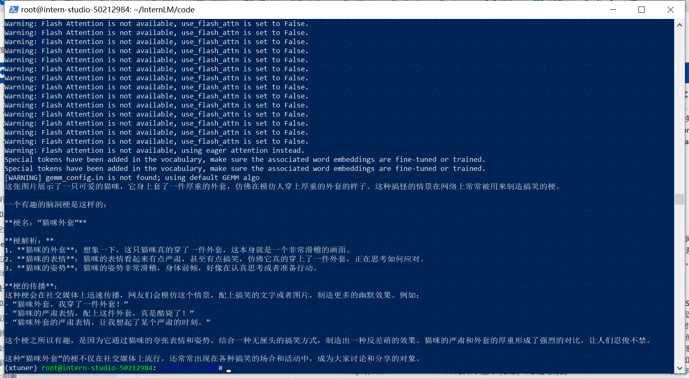
原图：
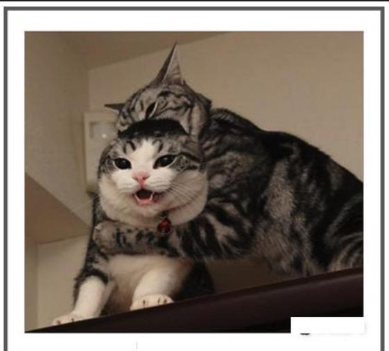
我们发现直接使用2b模型不能很好的讲出梗，现在我们要对这个2b模型进行微调。
### 3.2 准备数据集
数据集格式为：
```
# 为了高效训练，确保数据格式为：
{
    "id": "000000033471",
    "image": ["coco/train2017/000000033471.jpg"], # 如果是纯文本，则该字段为 None 或者不存在
    "conversations": [
      {
        "from": "human",
        "value": "<image>\nWhat are the colors of the bus in the image?"
      },
      {
        "from": "gpt",
        "value": "The bus in the image is white and red."
      }
    ]
  }
```
数据集上述复制进InternLM/datasets的数据。
### 3.3 配置微调参数
修改XTuner包下 InternVL的config配置，文件 /root/InternLM/code/XTuner/xtuner/configs/internvl/v2/internvl_v2_internlm2_2b_qlora_finetune.py 修改20-31行：

```python
# Model
path = '/root/share/new_models/OpenGVLab/InternVL2-2B'

# Data
data_root = '/root/InternLM/datasets/'
data_path = data_root + 'ex_cn.json'
image_folder = data_root
prompt_template = PROMPT_TEMPLATE.internlm2_chat
max_length = 8192

# Scheduler & Optimizer
batch_size = 4  # per_device
```
显卡升级到50%A100， 并调整参数batch_size==4
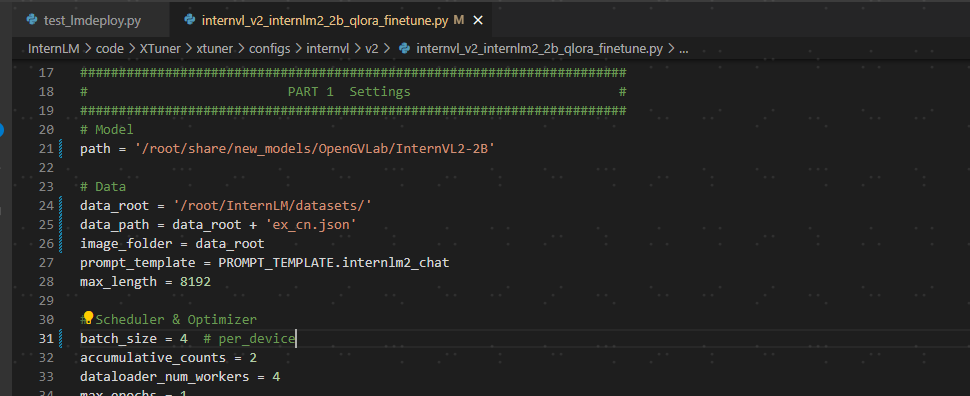
### 3.3 开始训练
```bash
cd /root/InternLM/code/XTuner
NPROC_PER_NODE=1 xtuner train /root/InternLM/code/XTuner/xtuner/configs/internvl/v2/internvl_v2_internlm2_2b_qlora_finetune.py  --work-dir /root/InternLM/work_dir/internvl_ft_run_8_filter  --deepspeed deepspeed_zero1
```
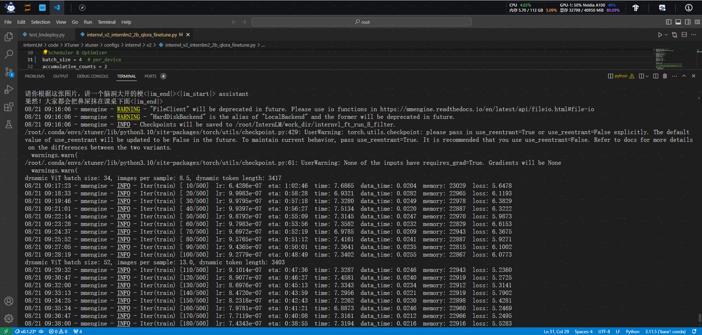
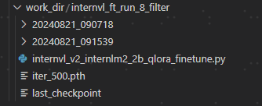
### 3.4 合并权重&&模型转换
用官方脚本进行权重合并
>如果这里执行的epoch不是6，是小一些的数字。你可能会发现internvl_ft_run_8_filter下没有iter_3000.pth, 那你需要把iter_3000.pth切换成你internvl_ft_run_8_filter目录下的pth即可。
```bash
cd XTuner
# transfer weights
python3 xtuner/configs/internvl/v1_5/convert_to_official.py xtuner/configs/internvl/v2/internvl_v2_internlm2_2b_qlora_finetune.py /root/InternLM/work_dir/internvl_ft_run_8_filter/iter_500.pth /root/InternLM/InternVL2-2B/
```
最后我们的模型保存在：/root/InternLM/InternVL2-2B:
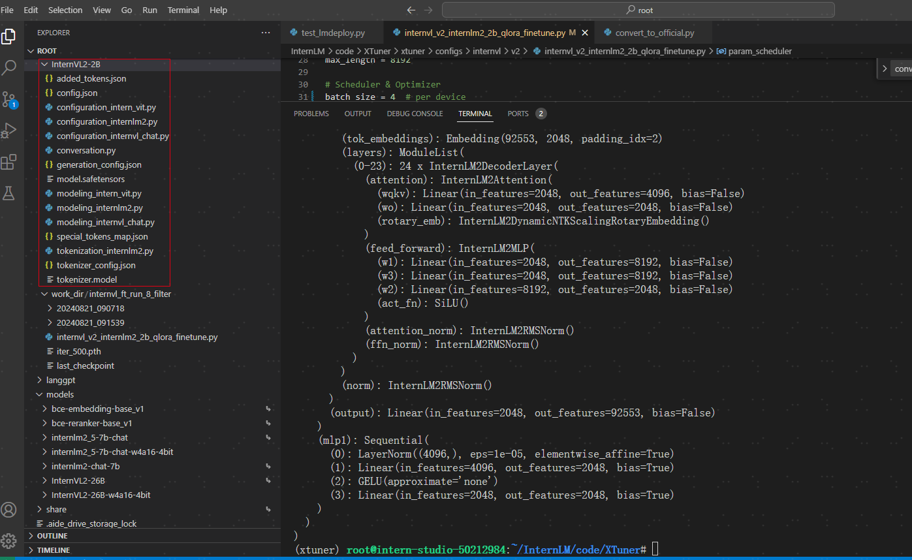
上述是教学团队帮忙用脚本一键转换了，合并转换详细步骤请参考： [基础课-XTuner微调个人小助手中的过程](https://github.com/zdq5337/aicarrier_study/blob/main/%E5%9F%BA%E7%A1%80%E8%AF%BE/L1.5-XTuner%E5%BE%AE%E8%B0%83%E4%B8%AA%E4%BA%BA%E5%B0%8F%E5%8A%A9%E6%89%8B%E8%AE%A4%E7%9F%A5.md#45-%E6%A8%A1%E5%9E%8B%E6%A0%BC%E5%BC%8F%E8%BD%AC%E6%8D%A2)

### 3.5 微调后效果对比
用微调后的模型，调整test_lmdeploy.py的代码模型路径
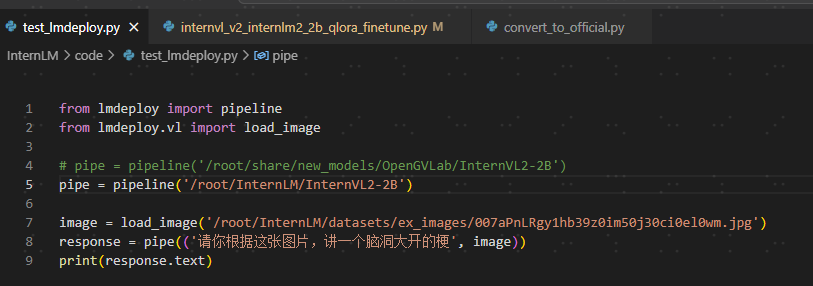
再次运行脚本python3 test_lmdeploy.py 执行推理结果。
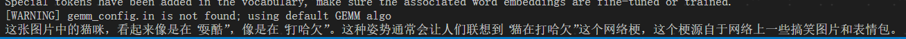

## 4 作业
### 4.1 作业1
follow 教学文档和视频使用QLoRA进行微调模型，复现微调效果，并能成功讲出梗图.
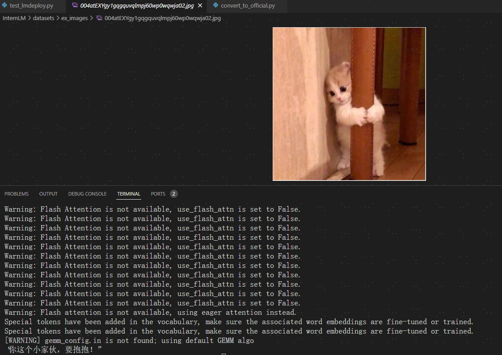
详细过程请参考 [第三章节-InternVL 微调推理部署梗图实践](#3-internvl-微调推理部署梗图实践)


## 参考资料：
- https://github.com/InternLM/Tutorial/blob/camp3/docs/L2/InternVL/joke_readme.md
- https://github.com/InternLM/Tutorial/blob/camp2/data_fine_tuning/data_fine_tuning.md
- https://www.bilibili.com/video/BV12E421A76T/?spm_id_from=333.788&vd_source=41bb3262014ad3cc41c3d25409df19be
- https://www.bilibili.com/video/BV1Dx4y1z7Ju/?spm_id_from=333.788&vd_source=41bb3262014ad3cc41c3d25409df19be
- https://www.bilibili.com/video/BV1vZ421M7ig/?spm_id_from=333.788&vd_source=41bb3262014ad3cc41c3d25409df19be