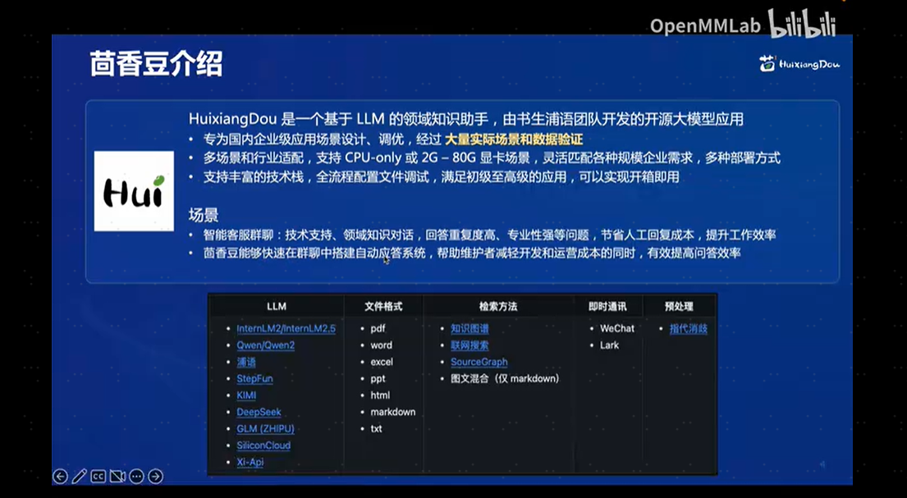
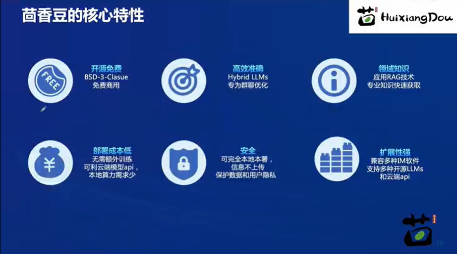
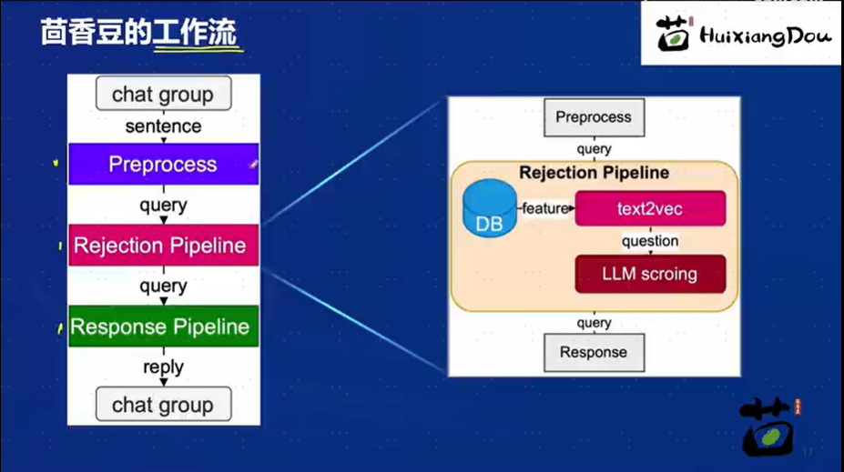
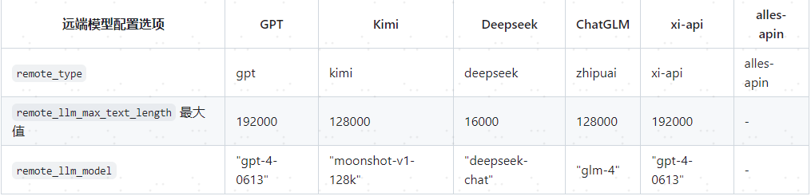
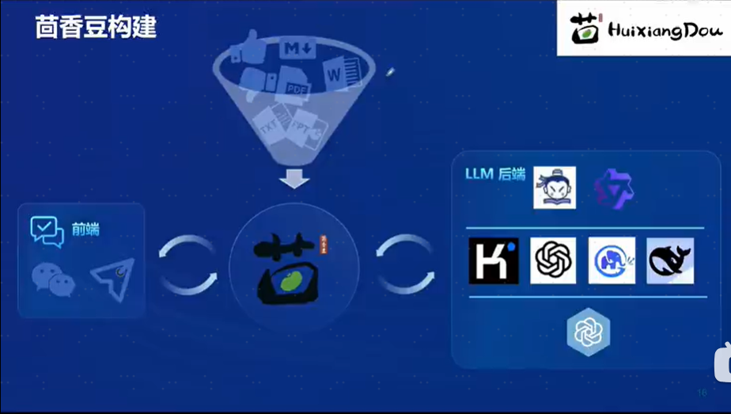
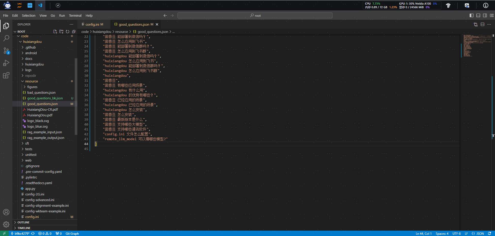
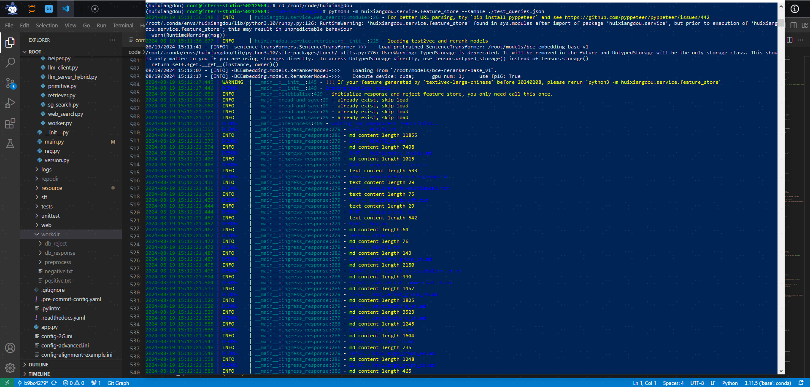

# 茴香豆：企业级知识库问答工具

## 1 基础知识概述
### 1.1 RAG 原理
RAG（Retrieval Augmented Generation）技术，通过检索与用户输入相关的信息片段，并结合外部知识库来生成更准确、更丰富的回答。解决 LLMs 在处理知识密集型任务时可能遇到的挑战, 如幻觉、知识过时和缺乏透明、可追溯的推理过程等。提供更准确的回答、降低推理成本、实现外部记忆。更多介绍请参考[基础课1.4](https://github.com/zdq5337/aicarrier_study/blob/main/%E5%9F%BA%E7%A1%80%E8%AF%BE/L1.4-llamaindex%2BInternlm2%20RAG%E5%AE%9E%E8%B7%B5.md)的内容。

RAG 能够让基础模型实现非参数知识更新，无需训练就可以掌握新领域的知识。

### 1.2 茴香豆介绍
[茴香豆](https://github.com/InternLM/HuixiangDou)应用了 RAG 技术，可以快速、高效的搭建自己的知识领域助手。



### 1.3 茴香豆工作原理
茴香豆并非单纯的 RAG 功能实现，而是一个专门针对群聊优化的知识助手，详情请阅读[技术报告](https://arxiv.org/abs/2401.08772)或观看[理论视频](https://www.bilibili.com/video/BV1QA4m1F7t4/?spm_id_from=333.788&vd_source=41bb3262014ad3cc41c3d25409df19be)。  
  
茴香豆的工作流：



### 1.4 茴香豆源码的文件结构：
```doc
.
├── LICENSE
├── README.md
├── README_zh.md
├── android
├── app.py
├── config-2G.ini
├── config-advanced.ini
├── config-experience.ini
├── config.ini # 配置文件
├── docs # 教学文档
├── huixiangdou # 存放茴香豆主要代码，重点学习
├── huixiangdou-inside.md
├── logs
├── repodir # 默认存放个人数据库原始文件，用户建立
├── requirements-lark-group.txt
├── requirements.txt
├── resource
├── setup.py
├── tests # 单元测试
├── web # 存放茴香豆 Web 版代码
└── web.log
└── workdir # 默认存放茴香豆本地向量数据库，用户建立
```
```doc
./huixiangdou
├── __init__.py
├── frontend # 存放茴香豆前端与用户端和通讯软件交互代码
│   ├── __init__.py
│   ├── lark.py
│   └── lark_group.py
├── main.py # 运行主贷
├── service # 存放茴香豆后端工作流代码
│   ├── __init__.py
│   ├── config.py #
│   ├── feature_store.py # 数据嵌入、特征提取代码
│   ├── file_operation.py
│   ├── helper.py
│   ├── llm_client.py
│   ├── llm_server_hybrid.py # 混合模型代码
│   ├── retriever.py # 检索模块代码
│   ├── sg_search.py # 增强搜索，图检索代码
│   ├── web_search.py # 网页搜索代码
│   └── worker.py # 主流程代码
└── version.py
```
茴香豆工作流中用到的 Prompt 位于 huixiangdou/service/worker.py 中。可以根据业务需求尝试调整 Prompt，打造你独有的茴香豆知识助手。
```doc  .nowrap
# Switch languages according to the scenario.
if self.language == 'zh':
    self.TOPIC_TEMPLATE = '告诉我这句话的主题，直接说主题不要解释：“{}”'
    self.SCORING_QUESTION_TEMPLTE = '“{}”\n请仔细阅读以上内容，判断句子是否是个有主题的疑问句，结果用 0～10 表示。直接提供得分不要解释。\n判断标准：有主语谓语宾语并且是疑问句得 10 分；缺少主谓宾扣分；陈述句直接得 0 分；不是疑问句直接得 0 分。直接提供得分不要解释。'  # noqa E501
    self.SCORING_RELAVANCE_TEMPLATE = '问题：“{}”\n材料：“{}”\n请仔细阅读以上内容，判断问题和材料的关联度，用0～10表示。判断标准：非常相关得 10 分；完全没关联得 0 分。直接提供得分不要解释。\n'  # noqa E501
    self.KEYWORDS_TEMPLATE = '谷歌搜索是一个通用搜索引擎，可用于访问互联网、查询百科知识、了解时事新闻等。搜索参数类型 string， 内容是短语或关键字，以空格分隔。\n你现在是{}交流群里的技术助手，用户问“{}”，你打算通过谷歌搜索查询相关资料，请提供用于搜索的关键字或短语，不要解释直接给出关键字或短语。'  # noqa E501
    self.SECURITY_TEMAPLTE = '判断以下句子是否涉及政治、辱骂、色情、恐暴、宗教、网络暴力、种族歧视等违禁内容，结果用 0～10 表示，不要解释直接给出得分。判断标准：涉其中任一问题直接得 10 分；完全不涉及得 0 分。直接给得分不要解释：“{}”'  # noqa E501
    self.PERPLESITY_TEMPLATE = '“question:{} answer:{}”\n阅读以上对话，answer 是否在表达自己不知道，回答越全面得分越少，用0～10表示，不要解释直接给出得分。\n判断标准：准确回答问题得 0 分；答案详尽得 1 分；知道部分答案但有不确定信息得 8 分；知道小部分答案但推荐求助其他人得 9 分；不知道任何答案直接推荐求助别人得 10 分。直接打分不要解释。'  # noqa E501
    self.SUMMARIZE_TEMPLATE = '{} \n 仔细阅读以上内容，总结得简短有力点'  # noqa E501
    # self.GENERATE_TEMPLATE = '材料：“{}”\n 问题：“{}” \n 请仔细阅读参考材料回答问题，材料可能和问题无关。如果材料和问题无关，尝试用你自己的理解来回答问题。如果无法确定答案，直接回答不知道。'  # noqa E501
    self.GENERATE_TEMPLATE = '材料：“{}”\n 问题：“{}” \n 请仔细阅读参考材料回答问题。'  # noqa E501
```

## 2 茴香豆的一些进阶用法
### 2.1 加入网络搜索  
茴香豆除了可以从本地向量数据库中检索内容进行回答，也可以加入网络的搜索结果，生成回答。
1. 登录 [Serper](https://serper.dev/) ，注册。
2. 进入 [Serper API](https://serper.dev/api-key) 界面，复制自己的 API-key。
3. 替换 /huixiangdou/config.ini 中的 ${YOUR-API-KEY} 为自己的API-key：
```doc
[web_search]
# check https://serper.dev/api-key to get a free API key
x_api_key = "${YOUR-API-KEY}"
domain_partial_order = ["openai.com", "pytorch.org", "readthedocs.io", "nvidia.com", "stackoverflow.com", "juejin.cn", "zhuanlan.zhihu.com", "www.cnblogs.com"]
save_dir = "logs/web_search_result"
```
其中 domain_partial_order 可以设置网络搜索的范围。

### 2.2 使用远程模型
茴香豆除了可以使用本地大模型，还可以轻松的调用云端模型 API。目前已经支持 Kimi，GPT-4，Deepseek 和 GLM 等常见大模型API。通过修改 /huixiangdou/config.ini 文件使用远端大模型。

配置enable_local = 0 关闭本地模型，enable_remote = 1 # 启用云端模型。其他配置选项：

启用远程模型可以大大降低GPU显存需求，根据测试，采用远程模型的茴香豆应用，最小只需要2G显存即可。  
也可以尝试同时开启 local 和 remote 模型，茴香豆将采用混合模型的方案，详见 [技术报告](https://arxiv.org/abs/2401.08772)，效果更好。  

### 2.3 配置文件解析 
茴香豆的配置文件位于代码主目录下，采用 Toml 形式，有着丰富的功能，下面将解析配置文件中重要的常用参数。
```doc
[feature_store]
...
reject_throttle = 0.22742061846268935
...
embedding_model_path = "/root/models/bce-embedding-base_v1"
reranker_model_path = "/root/models/bce-reranker-base_v1"
...
work_dir = "workdir"
```
reject_throttle: 拒答阈值，0-1，数值越大，回答的问题相关性越高。拒答分数在检索过程中通过与示例问题的相似性检索得出，高质量的问题得分高，无关、低质量的问题得分低。只有得分数大于拒答阈值的才会被视为相关问题，用于回答的生成。当闲聊或无关问题较多的环境可以适当调高。 embedding_model_path 和 reranker_model_path: 嵌入和重排用到的模型路径。不设置本地模型路径情况下，默认自动通过 Huggingface 下载。开始自动下载前，需要使用下列命令登录 Huggingface 账户获取权限：
```bash
huggingface-cli login
```
work_dir: 向量数据库路径。茴香豆安装后，可以通过切换向量数据库路径，来回答不同知识领域的问答。
```doc
[llm.server]
...
local_llm_path = "/root/models/internlm2-chat-1_8b"
local_llm_max_text_length = 3000
...
```
>local_llm_path: 本地模型文件夹路径或模型名称。现支持 书生·浦语 和 通义千问 模型类型，调用 transformers 的 AutoModels 模块，除了模型路径，输入 Huggingface 上的模型名称，如*"internlm/internlm2-chat-7b"、"qwen/qwen-7b-chat-int8"、"internlm/internlm2-chat-20b"*，也可自动拉取模型文件。 local_llm_max_text_length: 模型可接受最大文本长度。  

远端模型支持参考 [2.2小节](#22-使用远程模型)。  
```doc
[worker]
# enable search enhancement or not
enable_sg_search = 0
save_path = "logs/work.txt"
...
```
>[worker]: 增强搜索功能，配合 [sg_search] 使用。增强搜索利用知识领域的源文件建立图数据库，当模型判断问题为无关问题或回答失败时，增强搜索功能将利用 LLM 提取的关键词在该图数据库中搜索，并尝试用搜索到的内容重新生成答案。在 config.ini 中查看 [sg_search] 具体配置示例。
```doc
[worker.time]
start = "00:00:00"
end = "23:59:59"
has_weekday = 1
```
>[worker.time]: 可以设置茴香豆每天的工作时间，通过 start 和 end 设定应答的起始和结束时间。 has_weekday: = 1 的时候，周末不应答😂（豆哥拒绝 996）。

[fronted]: 前端交互设置。[茴香豆代码仓库](https://github.com/InternLM/HuixiangDou/tree/main/docs) 查看具体教程。

### 2.4 利用 Gradio 搭建网页 Demo
[茴香豆 Web 版](https://openxlab.org.cn/apps/detail/tpoisonooo/huixiangdou-web) 在 OpenXLab 上部署了混合模型的 Demo，可上传自己的语料库测试效果。  
自己搭建部署参考[利用 Gradio 搭建网页 Demo](#3-茴香豆构建知识库实践)的内容。

## 3 茴香豆构建知识库实践
### 3.1 构建过程


### 3.2 基础环境
新建开发机：新建--个人开发机--开发机名称：茴香豆--镜像Cuda11.7-conda--资源配置选择30%A100
```bash
# 创建环境
studio-conda -o internlm-base -t huixiangdou
# 激活环境
conda activate huixiangdou

# 复制BCE模型
ln -s /root/share/new_models/maidalun1020/bce-embedding-base_v1 /root/models/bce-embedding-base_v1
ln -s /root/share/new_models/maidalun1020/bce-reranker-base_v1 /root/models/bce-reranker-base_v1

# 复制大模型参数（下面的模型，根据作业进度和任务进行**选择一个**就行）
ln -s /root/share/new_models/Shanghai_AI_Laboratory/internlm2-chat-7b /root/models/internlm2-chat-7b

```
### 3.3 下载安装茴香豆
安装茴香豆运行所需依赖。
```bash
# 安装 python 依赖
pip install protobuf==4.25.3 accelerate==0.28.0 aiohttp==3.9.3 auto-gptq==0.7.1 bcembedding==0.1.3 beautifulsoup4==4.8.2 einops==0.7.0 faiss-gpu==1.7.2 langchain==0.1.14 loguru==0.7.2 lxml_html_clean==0.1.0 openai==1.16.1 openpyxl==3.1.2 pandas==2.2.1 pydantic==2.6.4 pymupdf==1.24.1 python-docx==1.1.0 pytoml==0.1.21 readability-lxml==0.8.1 redis==5.0.3 requests==2.31.0 scikit-learn==1.4.1.post1 sentence_transformers==2.2.2 textract==1.6.5 tiktoken==0.6.0 transformers==4.39.3 transformers_stream_generator==0.0.5 unstructured==0.11.2  duckduckgo_search==6.2.9

## 因为 Intern Studio 不支持对系统文件的永久修改，在 Intern Studio 安装部署的同学不建议安装 Word 依赖，后续的操作和作业不会涉及 Word 解析。
## 想要自己尝试解析 Word 文件的同学，uncomment 掉下面这行，安装解析 .doc .docx 必需的依赖
# apt update && apt -y install python-dev python libxml2-dev libxslt1-dev antiword unrtf poppler-utils pstotext tesseract-ocr flac ffmpeg lame libmad0 libsox-fmt-mp3 sox libjpeg-dev swig libpulse-dev

```
从茴香豆官方仓库下载茴香豆。
```bash
cd /root/code
# 克隆代码仓库
git clone https://github.com/internlm/huixiangdou && cd huixiangdou
git checkout b9bc427
```

### 3.4 修改茴香豆配置
修改配置文件/root/code/huixiangdou/config.ini的三个变量的值：
```
embedding_model_path = "/root/models/bce-embedding-base_v1"  #用于向量数据库和词嵌入的模型
reranker_model_path = "/root/models/bce-reranker-base_v1" #用于检索的重排序模型
local_llm_path = "/root/models/internlm2-chat-7b"
```
>配置文件具体含义和更多细节（包括私有服务器部署）参考[2.3 配置文件解析](#23-配置文件解析)。

### 3.5 创建知识库
本示例使用 InternLM 的 Huixiangdou 文档作为新增知识数据检索来源，在不重新训练的情况下，打造一个 Huixiangdou 技术问答助手。首先，下载 Huixiangdou 语料：
```bash
cd /root/code/huixiangdou && mkdir repodir
git clone https://github.com/internlm/huixiangdou --depth=1 repodir/huixiangdou
```
提取知识库特征，创建向量数据库。数据库向量化的过程应用到了 LangChain 的相关模块，默认嵌入和重排序模型调用的网易 BCE 双语模型，如果没有在 config.ini 文件中指定本地模型路径，茴香豆将自动从 HuggingFace 拉取默认模型。  

除了语料知识的向量数据库，茴香豆建立接受和拒答两个向量数据库，用来在检索的过程中更加精确的判断提问的相关性，这两个数据库的来源分别是：
- 接受问题列表，希望茴香豆助手回答的示例问题
    - 存储在 huixiangdou/resource/good_questions.json 中
- 拒绝问题列表，希望茴香豆助手拒答的示例问题
    - 存储在 huixiangdou/resource/bad_questions.json 中
    - 其中多为技术无关的主题或闲聊
    - 如："nihui 是谁", "具体在哪些位置进行修改？", "你是谁？", "1+1"  

运行下面的命令，增加茴香豆相关的问题到接受问题示例中：
```bash
cd /root/code/huixiangdou
mv resource/good_questions.json resource/good_questions_bk.json

echo '[
    "mmpose中怎么调用mmyolo接口",
    "mmpose实现姿态估计后怎么实现行为识别",
    "mmpose执行提取关键点命令不是分为两步吗，一步是目标检测，另一步是关键点提取，我现在目标检测这部分的代码是demo/topdown_demo_with_mmdet.py demo/mmdetection_cfg/faster_rcnn_r50_fpn_coco.py checkpoints/faster_rcnn_r50_fpn_1x_coco_20200130-047c8118.pth   现在我想把这个mmdet的checkpoints换位yolo的，那么应该怎么操作",
    "在mmdetection中，如何同时加载两个数据集，两个dataloader",
    "如何将mmdetection2.28.2的retinanet配置文件改为单尺度的呢？",
    "1.MMPose_Tutorial.ipynb、inferencer_demo.py、image_demo.py、bottomup_demo.py、body3d_pose_lifter_demo.py这几个文件和topdown_demo_with_mmdet.py的区别是什么，\n2.我如果要使用mmdet是不是就只能使用topdown_demo_with_mmdet.py文件，",
    "mmpose 测试 map 一直是 0 怎么办？",
    "如何使用mmpose检测人体关键点？",
    "我使用的数据集是labelme标注的，我想知道mmpose的数据集都是什么样式的，全都是单目标的数据集标注，还是里边也有多目标然后进行标注",
    "如何生成openmmpose的c++推理脚本",
    "mmpose",
    "mmpose的目标检测阶段调用的模型，一定要是demo文件夹下的文件吗，有没有其他路径下的文件",
    "mmpose可以实现行为识别吗，如果要实现的话应该怎么做",
    "我在mmyolo的v0.6.0 (15/8/2023)更新日志里看到了他新增了支持基于 MMPose 的 YOLOX-Pose，我现在是不是只需要在mmpose/project/yolox-Pose内做出一些设置就可以，换掉demo/mmdetection_cfg/faster_rcnn_r50_fpn_coco.py 改用mmyolo来进行目标检测了",
    "mac m1从源码安装的mmpose是x86_64的",
    "想请教一下mmpose有没有提供可以读取外接摄像头，做3d姿态并达到实时的项目呀？",
    "huixiangdou 是什么？",
    "使用科研仪器需要注意什么？",
    "huixiangdou 是什么？",
    "茴香豆 是什么？",
    "茴香豆 能部署到微信吗？",
    "茴香豆 怎么应用到飞书",
    "茴香豆 能部署到微信群吗？",
    "茴香豆 怎么应用到飞书群",
    "huixiangdou 能部署到微信吗？",
    "huixiangdou 怎么应用到飞书",
    "huixiangdou 能部署到微信群吗？",
    "huixiangdou 怎么应用到飞书群",
    "huixiangdou",
    "茴香豆",
    "茴香豆 有哪些应用场景",
    "huixiangdou 有什么用",
    "huixiangdou 的优势有哪些？",
    "茴香豆 已经应用的场景",
    "huixiangdou 已经应用的场景",
    "huixiangdou 怎么安装",
    "茴香豆 怎么安装",
    "茴香豆 最新版本是什么",
    "茴香豆 支持哪些大模型",
    "茴香豆 支持哪些通讯软件",
    "config.ini 文件怎么配置",
    "remote_llm_model 可以填哪些模型?"
]' > /root/code/huixiangdou/resource/good_questions.json
```

再创建一个测试用的问询列表，用来测试拒答流程是否起效：
```bash
cd /root/huixiangdou

echo '[
"huixiangdou 是什么？",
"你好，介绍下自己"
]' > ./test_queries.json

```
在确定好语料来源后，运行下面的命令，创建 RAG 检索过程中使用的向量数据库：
```bash
# 创建向量数据库存储目录
cd /root/code/huixiangdou && mkdir workdir 

# 分别向量化知识语料、接受问题和拒绝问题中后保存到 workdir
python3 -m huixiangdou.service.feature_store --sample ./test_queries.json

```
向量数据库的创建需要等待一小段时间，过程约占用 1.6G 显存。  
完成后，Huixiangdou 相关的新增知识就以向量数据库的形式存储在 workdir 文件夹下。


检索过程中，茴香豆会将输入问题与两个列表中的问题在向量空间进行相似性比较，判断该问题是否应该回答，避免群聊过程中的问答泛滥。确定的回答的问题会利用基础模型提取关键词，在知识库中检索 top K 相似的 chunk，综合问题和检索到的 chunk 生成答案。

### 3.6 运行茴香豆知识助手
我们已经提取了知识库特征，并创建了对应的向量数据库。现在，让我们来测试一下效果：
```bash
# 填入问题
sed -i '74s/.*/    queries = ["huixiangdou 是什么？", "茴香豆怎么部署到微信群", "今天天气怎么样？"]/' /root/code/huixiangdou/huixiangdou/main.py

# 运行茴香豆
cd /root/code/huixiangdou/
python3 -m huixiangdou.main --standalone
```


## 4 作业 - 基础任务
使用 茴香豆 Web 版在 InternLM Studio 上部署茴香豆技术助手。

### 4.1 环境准备
先安装 Gradio 依赖组件：
```bash
pip install gradio==4.25.0 redis==5.0.3 flask==3.0.2 lark_oapi==1.2.4
```
### 4.2 运行脚本，启动茴香豆对话 Demo 服务
```bash
cd /root/code/huixiangdou
python3 -m tests.test_query_gradio 
```

### 4.3 运行
配置端口映射（ssh -CNg -L 7860:127.0.0.1:7860 root@ssh.intern-ai.org.cn -p 36398 ）后，就可以在本地通过浏览器访问：http://127.0.0.1:7860 web页面：


对语义理解不是很好（看日志rag召回内容没问题），比如goodcase中配置了“config.ini 文件怎么配置”，回答正常：

换了个问法：“config.ini 文件如何配置”，就回答不明白了


### 4.4 运行
repodir文件夹下加入私有知识库文件，重新执行 python3 -m huixiangdou.service.feature_store --sample ./test_queries.json 做Embedding：

提问私有知识可以准确作答了：


## 5 附录
1. 茴香豆案例demo（将茴香豆链接到即时通讯软件）：https://github.com/InternLM/HuixiangDou/tree/main/docs
2. 打造自己的茴香豆 Web 版：https://github.com/InternLM/HuixiangDou/tree/main/web

